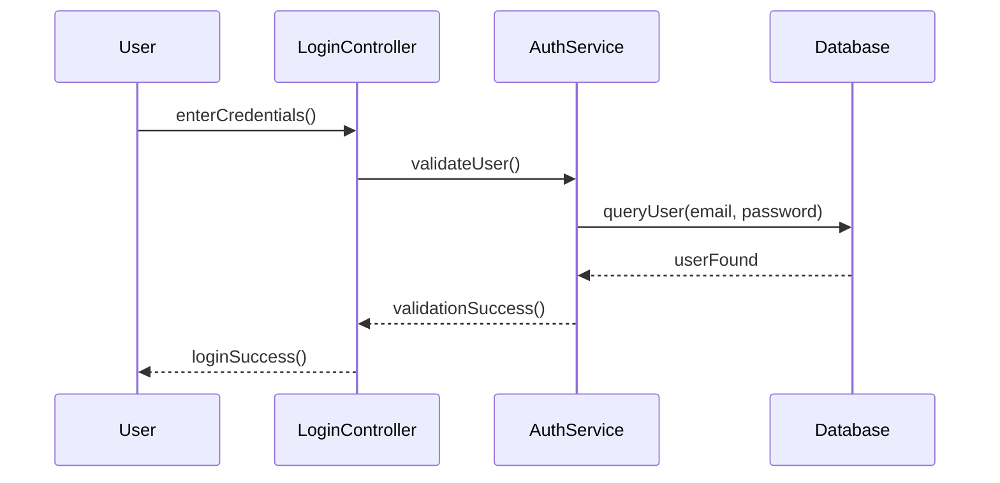
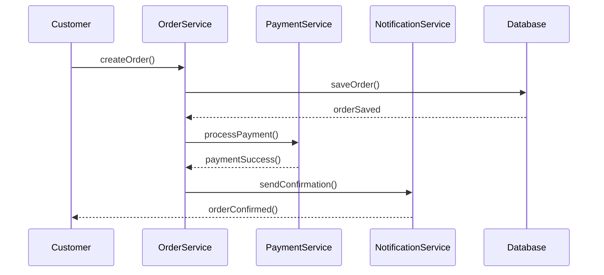
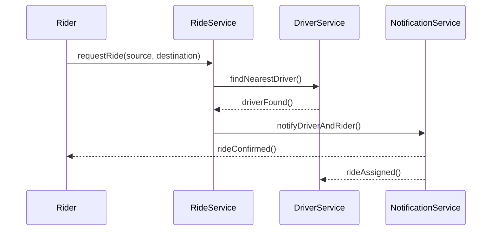

# 🔄 Sequence Diagrams — Visualizing System Interactions

A **Sequence Diagram** is a type of **UML Behavioral Diagram** that shows **how objects interact over time** to complete a specific process or function.

It focuses on **message flow**, **object lifelines**, and **execution order** — helping you visualize **runtime behavior** of a system.

---

## 🧠 What Is a Sequence Diagram?

A **Sequence Diagram** represents:

- The **sequence of messages** exchanged between system components.
- The **order of execution** and **timing** of operations.
- The interaction between **users**, **APIs**, **databases**, and **services**.

Think of it as a **time-based conversation chart** between objects.

---

## 🧩 Core Elements

| Element | Description |
|:----------|:-------------|
| **Actor** | External entity initiating the interaction (e.g., user, external service). |
| **Object/Lifeline** | Represents a class, module, or component involved in the interaction. |
| **Message (Arrow)** | Represents method call, signal, or communication. |
| **Activation Bar** | Time duration during which an object is active or processing a message. |
| **Return Message** | Response sent back after processing a request. |

---

## 🏗️ Basic Example — User Login Flow

### Description:
1. User submits login credentials.  
2. Controller passes them to AuthService.  
3. AuthService validates credentials via Database.  
4. Database returns result.  
5. AuthService returns success or failure to Controller.  
6. Controller responds to the User.

---

### 🧱 UML Representation (ASCII)

---

### 🪄 Mermaid Example (Renders on GitHub)

### 🛍️ Real-World Example — E-Commerce Checkout Flow
#### Scenario
A customer places an order, which triggers payment and notification processes.

### 🚗 Example — Ride-Sharing App (Uber/Ola)
#### Scenario
A Rider requests a ride, system finds a nearby driver, and ride confirmation is sent.

---

## 🧱 Sequence Diagram Symbols
| Symbol | Meaning |
|:----|:----|
|➡️ Solid Arrow	|Synchronous message (function call).|
|↔️ Dotted Arrow |	Return message or asynchronous event.|
|▮ Activation Bar | Execution period of a component.|
|☁️ Actor |	External system or user.|

---

## 🧰 Tools to Create Sequence Diagrams
- [**PlantUML**](https://plantuml.com/class-diagram)
- [**Mermaid (Markdown Diagrams)**](https://mermaid.js.org/syntax/classDiagram.html)
- [**Lucidchart**](https://www.lucidchart.com/)
- [**Draw.io (diagrams.net)**](https://app.diagrams.net/)
- [**Visual Paradigm**](https://online.visual-paradigm.com/)

---

## 📘 References

- [GeeksforGeeks — Sequence Diagram in UML](https://www.geeksforgeeks.org/uml-sequence-diagram/)
- [PlantUML — Sequence Diagram Guide](https://plantuml.com/sequence-diagram)
- [Mermaid — Sequence Diagram Syntax](https://mermaid.js.org/syntax/sequenceDiagram.html)
- [UML.org — Official UML Specification](https://www.omg.org/uml/)

---

## 🏁 Summary
| Concept	| Description |
|:-----|:------|
| Purpose	|To visualize how system components communicate over time |
| Type	| Behavioral UML Diagram |
| Used In	| API workflows, request/response analysis, asynchronous systems |
| Focus	| Message ordering and object interaction |
| Outcome	| Clear, event-driven understanding of system behavior |
