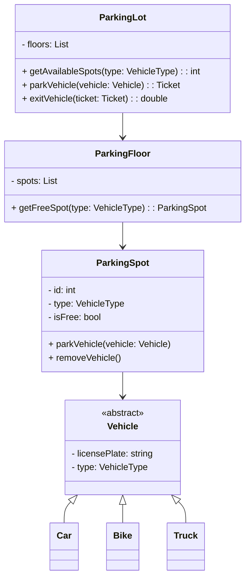

# 🧠 Real-World Low-Level Design (LLD) Example — Design a Parking Lot System

## 🎯 Objective
Design a **Parking Lot Management System** that handles vehicle entry, exit, and payment in a real-world scenario using **Object-Oriented Design (OOD)** and **SOLID principles**.

---

## 🏗️ 1. Problem Statement

You need to design a system for a parking lot with the following requirements:

### 🧩 Functional Requirements
- The parking lot has multiple floors.
- Each floor has multiple parking spots for different vehicle types (car, bike, truck).
- The system should:

  - Allow vehicles to **enter** and **exit**.
  - Issue a **parking ticket** on entry.
  - Calculate **parking charges** on exit.
  - Maintain status of parking spots (occupied/free).
  - Support different pricing for different vehicle types.

### ⚙️ Non-Functional Requirements
- The design should be **extensible** (e.g., new vehicle types, new payment methods).
- The system should be **thread-safe** and **efficient**.
- Follow **SOLID principles** and **clean architecture**.

---

## 🧱 2. Identifying Key Classes (LLD Breakdown)

| Entity | Responsibility |
|---------|----------------|
| `ParkingLot` | Entry point managing all floors and spots |
| `ParkingFloor` | Manages multiple parking spots |
| `ParkingSpot` | Represents an individual parking space |
| `Vehicle` | Abstract class for vehicles |
| `Car`, `Bike`, `Truck` | Concrete vehicle classes |
| `Ticket` | Represents parking ticket issued at entry |
| `Payment` | Handles payment processing |
| `EntranceGate`, `ExitGate` | Entry and exit control |
| `DisplayBoard` | Shows available spots per floor |

---

## 🧩 3. UML Class Diagram (Conceptual)



---

## 🧩 4. Enumerations
```cpp title="enumerations.cpp" linenums="1"
enum class VehicleType {
    CAR,
    BIKE,
    TRUCK
};
```

---

## 💡 5. Class Implementations (C++ Example)
### 🏠 Vehicle Base Class
```cpp title="vehicle-base.cpp" linenums="1"
class Vehicle {
protected:
    std::string licensePlate;
    VehicleType type;
public:
    Vehicle(std::string plate, VehicleType t) : licensePlate(plate), type(t) {}
    virtual ~Vehicle() = default;

    VehicleType getType() const { return type; }
};
```

### 🚗 Derived Classes
```cpp title="vehicle-derived.cpp" linenums="1"
class Car : public Vehicle {
public:
    Car(std::string plate) : Vehicle(plate, VehicleType::CAR) {}
};

class Bike : public Vehicle {
public:
    Bike(std::string plate) : Vehicle(plate, VehicleType::BIKE) {}
};
```

### 🅿️ ParkingSpot Class
```cpp title="parking-spot.cpp" linenums="1"
class ParkingSpot {
    int id;
    VehicleType type;
    bool isFree;
    Vehicle* parkedVehicle;
public:
    ParkingSpot(int id, VehicleType t) : id(id), type(t), isFree(true), parkedVehicle(nullptr) {}

    bool getIsFree() const { return isFree; }
    VehicleType getType() const { return type; }

    void parkVehicle(Vehicle* v) {
        if (!isFree || v->getType() != type) throw std::runtime_error("Spot unavailable");
        parkedVehicle = v;
        isFree = false;
    }

    void removeVehicle() {
        parkedVehicle = nullptr;
        isFree = true;
    }
};
```

### 🧾 Ticket Class
```cpp title="ticket.cpp" linenums="1"
class Ticket {
    std::string ticketId;
    time_t entryTime;
    Vehicle* vehicle;
public:
    Ticket(std::string id, Vehicle* v) : ticketId(id), vehicle(v) {
        entryTime = time(nullptr);
    }
    time_t getEntryTime() const { return entryTime; }
    Vehicle* getVehicle() const { return vehicle; }
};
```

### 💰 Payment Class
```cpp title="payment.cpp" linenums="1"
class Payment {
public:
    static double calculateFee(VehicleType type, double hours) {
        switch (type) {
            case VehicleType::CAR: return hours * 20;
            case VehicleType::BIKE: return hours * 10;
            case VehicleType::TRUCK: return hours * 30;
        }
        return 0;
    }
};
```

## 🔄 6. Flow of Control

- Vehicle enters → entrance gate calls ParkingLot::parkVehicle().
- System finds free spot using ParkingFloor::getFreeSpot().
- Spot marked as occupied → ticket issued.
- On exit → exit gate calls ParkingLot::exitVehicle().
- System calculates duration & fee → processes payment → frees spot.

## 🧮 7. Example Execution Flow
```cpp title="execution-flow.cpp" linenums="1"
int main() {
    ParkingSpot carSpot1(1, VehicleType::CAR);
    Car myCar("UP32-HBTU-999");

    try {
        carSpot1.parkVehicle(&myCar);
        std::cout << "Car parked successfully!\n";

        // Simulate parking duration
        double hours = 2.5;
        double amount = Payment::calculateFee(myCar.getType(), hours);
        std::cout << "Payment due: Rs. " << amount << std::endl;

        carSpot1.removeVehicle();
        std::cout << "Car exited successfully.\n";
    } catch (std::exception& e) {
        std::cerr << "Error: " << e.what() << std::endl;
    }
}
```

## 🔐 8. Key Design Principles Used
| Principle                 | Applied Example                                                                 |
| ------------------------- | ------------------------------------------------------------------------------- |
| **Single Responsibility** | Each class (Spot, Ticket, Payment) has one clear job                            |
| **Open/Closed**           | New vehicle types or pricing can be added without changing existing code        |
| **Liskov Substitution**   | All vehicles inherit from the same base class                                   |
| **Dependency Inversion**  | `ParkingLot` depends on abstractions (e.g., `VehicleType`) not concrete classes |
| **Encapsulation**         | Spot status and vehicle details are private                                     |

## 🔗 References

- [System Design Interview: Parking Lot Design – Medium](https://medium.com/@interviewnoodle/parking-lot-design-interview-question-6b3d4f8a9b14)
- [GeeksforGeeks – Object Oriented Design for Parking Lot](https://www.geeksforgeeks.org/system-design/design-parking-lot-using-object-oriented-principles/)
- [Refactoring Guru – SOLID Principles](https://refactoring.guru/design-patterns/solid)
