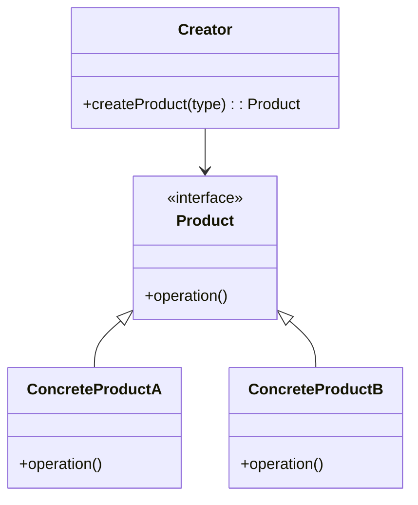

# 🏭 Factory Design Pattern

## 🧠 Introduction

The Factory Design Pattern is a creational design pattern that provides an interface for creating objects, but allows subclasses or separate classes to decide which object to instantiate.
It helps achieve loose coupling by separating the object creation logic from the main business logic.

---

## 💡 Real-Life Analogy

Imagine a vehicle manufacturing plant (factory).
Depending on the requirement, the factory can produce:
- 🚗 Car
- 🚲 Bike
- 🚚 Truck

The client doesn’t worry about how the vehicle is made — they just ask the factory for one.

---

## 🧩 When to Use

Use the Factory Pattern when:
- You need to create objects without exposing the creation logic.
- You have a superclass and want to delegate the instantiation of its subclasses.
- You want to centralize object creation for consistency and control.

---

## 🧱 Structure



---

## ⚙️ Implementation Example (C++)
    !!! example ""
    ```cpp title="factory-design.cpp" linenums="1"
    #include <iostream>
    #include <memory>
    #include <string>
    using namespace std;
    
    // Step 1: Create the Product Interface
    class Shape {
    public:
        virtual void draw() = 0;
        virtual ~Shape() = default;
    };
    
    // Step 2: Create Concrete Products
    class Circle : public Shape {
    public:
        void draw() override {
            cout << "Drawing a Circle 🟢" << endl;
        }
    };
    
    class Rectangle : public Shape {
    public:
        void draw() override {
            cout << "Drawing a Rectangle 🟥" << endl;
        }
    };
    
    class Triangle : public Shape {
    public:
        void draw() override {
            cout << "Drawing a Triangle 🔺" << endl;
        }
    };
    
    // Step 3: Create the Factory
    class ShapeFactory {
    public:
        static shared_ptr<Shape> getShape(const string& shapeType) {
            if (shapeType == "circle")
                return make_shared<Circle>();
            else if (shapeType == "rectangle")
                return make_shared<Rectangle>();
            else if (shapeType == "triangle")
                return make_shared<Triangle>();
            else
                return nullptr;
        }
    };
    
    // Step 4: Demonstrate Usage
    int main() {
        auto circle = ShapeFactory::getShape("circle");
        circle->draw();
    
        auto rectangle = ShapeFactory::getShape("rectangle");
        rectangle->draw();
    
        auto triangle = ShapeFactory::getShape("triangle");
        triangle->draw();
    
        return 0;
    }
    ```
    
---
    
    **🧮 Output**
    ```cpp linenums="1"
    Drawing a Circle 🟢
    Drawing a Rectangle 🟥
    Drawing a Triangle 🔺
    ```
---

## ✅ Benefits

- Encapsulation: Object creation logic is centralized.
- Loose Coupling: Client code is independent of concrete classes.
- Scalability: Adding a new product type requires minimal change.

## ⚠️ Drawbacks

- Can introduce complexity when overused.
- Requires modification in factory code to support new products (unless using Abstract Factory or Reflection).

---

##🚀 Real-World Examples

!!! details ""
    | Domain           | Example                                            |
    | ---------------- | -------------------------------------------------- |
    | Database Drivers | JDBC, MongoDB Client Factory                       |
    | GUI Libraries    | Creating buttons, text boxes for Windows/macOS     |
    | Game Engines     | Creating enemy types or weapons dynamically        |
    | Payment Systems  | Different payment processors (UPI, PayPal, Stripe) |

---

## 🧩 Types of Factory Patterns

- Simple Factory → A single factory class creates different products.
- Factory Method → Subclasses decide which class to instantiate.
- Abstract Factory → Factory of factories (used for families of related objects).

---

## 🧠 Difference Between Factory & Constructor

!!! details ""
    | Factory                            | Constructor              |
    | ---------------------------------- | ------------------------ |
    | Creates objects indirectly         | Creates objects directly |
    | Can decide object type dynamically | Fixed at compile time    |
    | Promotes loose coupling            | Promotes tight coupling  |

---

## 🔗 References
???+ link 
     - [Refactoring.Guru – Factory Method](https://refactoring.guru/design-patterns/factory-method)
     - [SourceMaking – Factory Pattern](https://sourcemaking.com/design_patterns/factory_method)
     