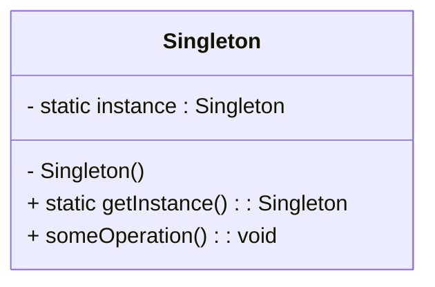

# 📘 Singleton Design Pattern

## 🎯 Intent

The Singleton Pattern ensures that only one instance of a class exists in the entire application and provides a global point of access to it.

---

## 🧠 Real-World Analogy

Think of a printer spooler or an OS configuration manager —
no matter how many times you request it, you always get the same instance managing resources.

---

## ⚙️ Problem

In some systems, creating multiple instances of a class could cause:

- Conflicting states (e.g., multiple loggers writing inconsistently)
- Resource contention (e.g., multiple database connections)
- Increased memory usage

Hence, we restrict the instantiation to one object only.

---

## 🧩 UML Class Diagram



---

## 💻 C++ Implementation

```cpp title="singleton-design.cpp" linenums="1"
#include <iostream>
#include <mutex>

class Singleton {
private:
    static Singleton* instance;
    static std::mutex mtx;

    // Private constructor
    Singleton() {
        std::cout << "Singleton Instance Created\n";
    }

public:
    // Delete copy/move operations
    Singleton(const Singleton&) = delete;
    Singleton& operator=(const Singleton&) = delete;

    static Singleton* getInstance() {
        std::lock_guard<std::mutex> lock(mtx);
        if (instance == nullptr) {
            instance = new Singleton();
        }
        return instance;
    }

    void showMessage() {
        std::cout << "Hello from Singleton instance!" << std::endl;
    }
};

// Initialize static members
Singleton* Singleton::instance = nullptr;
std::mutex Singleton::mtx;

int main() {
    Singleton* s1 = Singleton::getInstance();
    Singleton* s2 = Singleton::getInstance();

    s1->showMessage();

    if (s1 == s2)
        std::cout << "Both instances are the same (Singleton works!)" << std::endl;

    return 0;
}
```

---

## 🧩 Key Points

| Feature                 | Description                                                    |
| ----------------------- | -------------------------------------------------------------- |
| **Private Constructor** | Prevents creating objects with `new`                           |
| **Static Instance**     | Ensures only one instance exists                               |
| **Thread Safety**       | `std::mutex` ensures safe access in multithreaded environments |
| **Global Access Point** | `getInstance()` provides controlled access                     |

---

## 🧱 Advantages

- ✅ Controlled access to a single instance
- ✅ Reduces memory usage
- ✅ Ensures consistency across the application

---

##⚠️ Disadvantages

- ❌ Harder to unit test (global state)
- ❌ Violates Single Responsibility Principle (mixes object creation + logic)
- ❌ Can lead to hidden dependencies

---

##💡 When to Use

- Logging classes
- Database connection pools
- Configuration managers
- Thread pools

---

## 🧮 Alternative Approaches

- Use Dependency Injection frameworks (preferred in modern architectures)
- Use lazy initialization or smart pointers for better memory management

---

## 🧭 Design Principle

> “Ensure a class has only one instance and provide a global access point to it.”

---

## 🔗 References

- [Refactoring Guru — Singleton Pattern](https://refactoring.guru/design-patterns/singleton)
- [GeeksforGeeks — Singleton Design Pattern](https://www.geeksforgeeks.org/system-design/singleton-design-pattern-introduction/)
- [SourceMaking — Singleton](https://sourcemaking.com/design_patterns/singleton)
