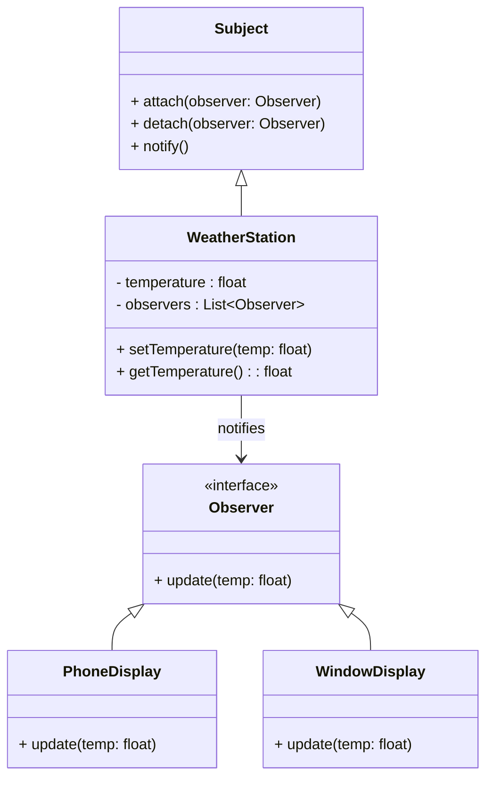

# 🧠 Observer Design Pattern
## 🎯 Intent

The Observer Design Pattern defines a one-to-many dependency between objects so that when one object (the Subject) changes state, all its dependents (Observers) are notified and updated automatically.
This pattern is widely used in real-time systems, UI event handling, and notification systems (e.g., stock price trackers, weather stations, chat systems).

---

## 🧩 1. Problem

Imagine a Weather Station that measures temperature.
You have multiple display devices (mobile app, web dashboard, smartwatch).
Whenever the weather data updates, all displays must update automatically.

Without a proper design:

- Each display must constantly check (poll) the weather data → inefficient.
- Tight coupling → difficult to add new display types.

---

## 💡 2. Solution

- Use the Observer Pattern:
- The Subject maintains a list of observers.
- Observers “subscribe” to updates.
- When the subject changes, it notifies all observers automatically.

---

## 🧱 3. UML Class Diagram



## ⚙️ 4. C++ Implementation

```cpp
#include <iostream>
#include <vector>
#include <algorithm>
using namespace std;

// ----- Observer Interface -----
class Observer {
public:
    virtual void update(float temp) = 0;
    virtual ~Observer() = default;
};

// ----- Subject Interface -----
class Subject {
public:
    virtual void attach(Observer* obs) = 0;
    virtual void detach(Observer* obs) = 0;
    virtual void notify() = 0;
    virtual ~Subject() = default;
};

// ----- Concrete Subject -----
class WeatherStation : public Subject {
    float temperature;
    vector<Observer*> observers;

public:
    void attach(Observer* obs) override {
        observers.push_back(obs);
    }

    void detach(Observer* obs) override {
        observers.erase(remove(observers.begin(), observers.end(), obs), observers.end());
    }

    void setTemperature(float temp) {
        temperature = temp;
        cout << "\n🌡️ Temperature updated to: " << temp << "°C\n";
        notify();
    }

    void notify() override {
        for (auto* obs : observers)
            obs->update(temperature);
    }
};

// ----- Concrete Observers -----
class PhoneDisplay : public Observer {
public:
    void update(float temp) override {
        cout << "📱 Phone Display -> Current Temp: " << temp << "°C\n";
    }
};

class WindowDisplay : public Observer {
public:
    void update(float temp) override {
        cout << "🖥️ Window Display -> Current Temp: " << temp << "°C\n";
    }
};

// ----- Main -----
int main() {
    WeatherStation station;
    PhoneDisplay phone;
    WindowDisplay window;

    // Observers subscribe
    station.attach(&phone);
    station.attach(&window);

    // Change state
    station.setTemperature(28.5);
    station.setTemperature(31.2);

    // Detach one observer
    station.detach(&phone);
    station.setTemperature(26.8);

    return 0;
}
```

## 🔄 5. Flow of Execution

- WeatherStation (Subject) keeps a list of observers.
- PhoneDisplay and WindowDisplay subscribe.
- When temperature changes → all observers are notified automatically.
- Observers update their UI instantly.

---

## 🧩 6. Real-World Applications

| Use Case                 | Example                               |
| ------------------------ | ------------------------------------- |
| **Event Listeners**      | Button click → UI updates             |
| **Stock Market Tracker** | Notify all users when a stock changes |
| **Chat System**          | Notify participants of new messages   |
| **IoT Devices**          | Sensors notifying connected devices   |

---

## 🔐 7. Key Design Principles

| Principle                 | Explanation                                                                 |
| ------------------------- | --------------------------------------------------------------------------- |
| **Loose Coupling**        | Subject and observers know only the interface, not concrete implementations |
| **Open/Closed Principle** | New observers can be added without changing subject logic                   |
| **Encapsulation**         | Internal state changes are hidden; only notifications are exposed           |

---

## 📘 8. Summary

| Role                 | Description                                   |
| -------------------- | --------------------------------------------- |
| **Subject**          | Maintains list of observers and notifies them |
| **Observer**         | Interface defining update behavior            |
| **ConcreteSubject**  | Implements subject behavior                   |
| **ConcreteObserver** | Implements update logic                       |

---

🔗 9. References

- [Refactoring.Guru – Observer Pattern](https://refactoring.guru/design-patterns/observer)
- [SourceMaking – Observer Pattern](https://sourcemaking.com/design_patterns/observer)
- [Wikipedia – Observer Pattern](https://en.wikipedia.org/wiki/Observer_pattern)
- [GeeksforGeeks – Observer Design Pattern](https://www.geeksforgeeks.org/system-design/observer-pattern-set-1-introduction/)
