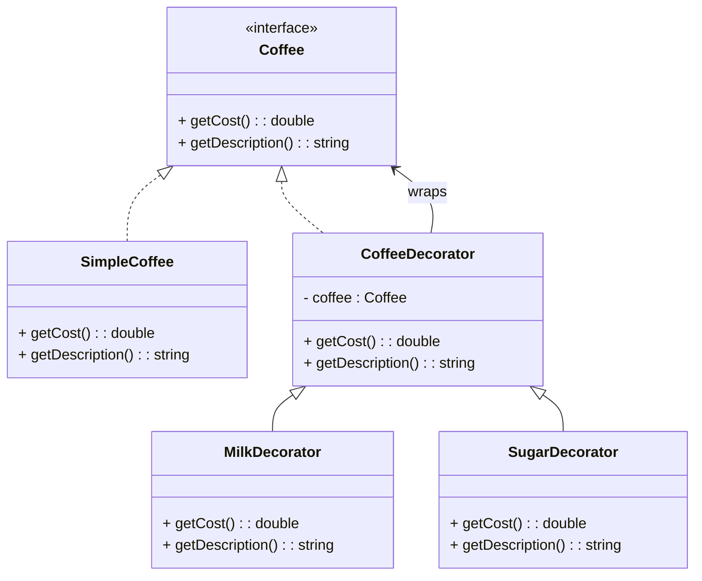

# 🎨 Decorator Design Pattern

## 🧠 Intent

The Decorator Design Pattern allows you to dynamically add new behavior or responsibilities to an object without modifying its structure.
It’s part of the Structural Design Patterns family and promotes composition over inheritance.

---

##⚡ Problem

Imagine you are building a Coffee Ordering System.
You start with a simple `Coffee` class.
Later, you want to add:

- Milk ☕
- Sugar 🍬
- Whipped Cream 🍦
- Caramel 🍯
Instead of creating dozens of subclasses like MilkCoffee, SugarCoffee, MilkSugarCoffee, etc.,
you can use decorators to add features dynamically at runtime.

---

## 💡 Solution

- Create a Component interface that defines the core behavior (getCost(), getDescription()).
- Implement a Concrete Component (e.g., SimpleCoffee).
- Create an Abstract Decorator that also implements the same interface and wraps another component.
- Extend decorators like MilkDecorator, SugarDecorator, etc., to enhance behavior.

---

## 🧱 UML Class Diagram


---

## ⚙️ C++ Implementation
```cpp title="decorator-design.cpp" linenums="1"
#include <iostream>
#include <memory>
using namespace std;

// ----- Component Interface -----
class Coffee {
public:
    virtual double getCost() const = 0;
    virtual string getDescription() const = 0;
    virtual ~Coffee() = default;
};

// ----- Concrete Component -----
class SimpleCoffee : public Coffee {
public:
    double getCost() const override { return 50.0; }
    string getDescription() const override { return "Simple Coffee"; }
};

// ----- Abstract Decorator -----
class CoffeeDecorator : public Coffee {
protected:
    shared_ptr<Coffee> coffee;
public:
    CoffeeDecorator(shared_ptr<Coffee> c) : coffee(move(c)) {}
};

// ----- Concrete Decorators -----
class MilkDecorator : public CoffeeDecorator {
public:
    MilkDecorator(shared_ptr<Coffee> c) : CoffeeDecorator(move(c)) {}
    double getCost() const override { return coffee->getCost() + 20.0; }
    string getDescription() const override { return coffee->getDescription() + ", Milk"; }
};

class SugarDecorator : public CoffeeDecorator {
public:
    SugarDecorator(shared_ptr<Coffee> c) : CoffeeDecorator(move(c)) {}
    double getCost() const override { return coffee->getCost() + 10.0; }
    string getDescription() const override { return coffee->getDescription() + ", Sugar"; }
};

class CaramelDecorator : public CoffeeDecorator {
public:
    CaramelDecorator(shared_ptr<Coffee> c) : CoffeeDecorator(move(c)) {}
    double getCost() const override { return coffee->getCost() + 30.0; }
    string getDescription() const override { return coffee->getDescription() + ", Caramel"; }
};

// ----- Client Code -----
int main() {
    shared_ptr<Coffee> coffee = make_shared<SimpleCoffee>();
    cout << coffee->getDescription() << " → ₹" << coffee->getCost() << endl;

    coffee = make_shared<MilkDecorator>(coffee);
    coffee = make_shared<SugarDecorator>(coffee);
    coffee = make_shared<CaramelDecorator>(coffee);

    cout << coffee->getDescription() << " → ₹" << coffee->getCost() << endl;
}
```

---

## 🧩 Output
```nginx
Simple Coffee → ₹50
Simple Coffee, Milk, Sugar, Caramel → ₹110
```

---

## 🧠 Key Design Concepts
| Principle                        | Description                                                   |
| -------------------------------- | ------------------------------------------------------------- |
| **Open/Closed Principle**        | You can add new behavior without modifying existing code      |
| **Composition Over Inheritance** | Behavior is added dynamically using object composition        |
| **Single Responsibility**        | Each decorator focuses on one enhancement (e.g., sugar, milk) |

---

## 🚀 Real-World Use Cases
| Domain               | Example                                                          |
| -------------------- | ---------------------------------------------------------------- |
| **UI Frameworks**    | Adding scrollbars, borders, shadows to windows or widgets        |
| **Middleware**       | Adding logging, authentication, and caching around core services |
| **Game Development** | Adding power-ups to characters dynamically                       |
| **Data Processing**  | Wrapping data streams with filters or compression decorators     |

## 🧩 Advantages

✅ Flexible and reusable design
✅ Promotes modularity and scalability
✅ Reduces subclass explosion
✅ Runtime behavior modification

## ⚠️ Disadvantages

❌ Increases complexity due to multiple small objects
❌ Debugging can become difficult with multiple layers of wrapping

## 🔗 References

- [Refactoring.Guru – Decorator Pattern](https://refactoring.guru/design-patterns/decorator)
- [SourceMaking – Decorator Pattern](https://sourcemaking.com/design_patterns/decorator)
- [GeeksforGeeks – Decorator Design Pattern](https://www.geeksforgeeks.org/system-design/decorator-pattern/)
- [Wikipedia – Decorator Pattern](https://en.wikipedia.org/wiki/Decorator_pattern)
