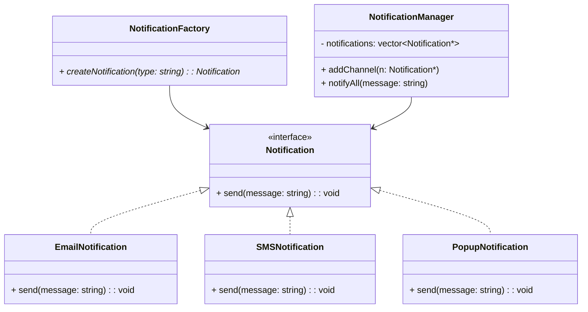

# 🧠 Design a Notification System 
## 🎯 Objective

Design a flexible Notification System that can dynamically send notifications via SMS, Email, or Popup — and easily extend to other channels (like WhatsApp, Push, Slack, etc.) without modifying the core system.

---

## 🧩 1. Problem Statement

- You need to design a notification service that:
- Can send notifications to users through multiple channels.
- Should support plug-and-play extensibility — adding a new channel must not break existing code.
- Should scale efficiently when the number of notifications increases.

---

## 🧰 2. Functional Requirements

✅ Send notifications via multiple channels:

- SMS
- Email
- Popup (in-app/web)

✅ Add new channels easily (e.g., WhatsApp, Slack).
✅ Dynamically increase notifications (load scaling).
✅ Provide consistent message formatting.

---

## ⚙️ 3. Non-Functional Requirements

| Concern           | Requirement                                                   |
| ----------------- | ------------------------------------------------------------- |
| **Scalability**   | System must handle a growing number of notifications          |
| **Extensibility** | New notification types can be added with minimal code changes |
| **Reusability**   | Common logic (message building, logging) should be shared     |
| **Reliability**   | Ensure message delivery retry mechanisms                      |

---

## 🧱 4. UML Class Diagram


---

## 💡 5. Design Approach

This design follows:

- Factory Pattern — for creating notifications dynamically.
- Strategy Pattern — each notification type implements its own strategy for sending messages.
- Open/Closed Principle (SOLID) — easily add new types without changing existing code.

---

## 🧮 6. C++ Implementation
```cpp title="notification-system.cpp" linenums="1"
#include <iostream>
#include <vector>
#include <memory>
#include <string>
using namespace std;

// ----- Notification Interface -----
class Notification {
public:
    virtual void send(const string& message) = 0;
    virtual ~Notification() = default;
};

// ----- Concrete Notification Types -----
class EmailNotification : public Notification {
public:
    void send(const string& message) override {
        cout << "📧 Sending Email: " << message << endl;
    }
};

class SMSNotification : public Notification {
public:
    void send(const string& message) override {
        cout << "📱 Sending SMS: " << message << endl;
    }
};

class PopupNotification : public Notification {
public:
    void send(const string& message) override {
        cout << "💬 Showing Popup: " << message << endl;
    }
};

// ----- Factory Pattern -----
class NotificationFactory {
public:
    static shared_ptr<Notification> createNotification(const string& type) {
        if (type == "email") return make_shared<EmailNotification>();
        else if (type == "sms") return make_shared<SMSNotification>();
        else if (type == "popup") return make_shared<PopupNotification>();
        else throw runtime_error("❌ Unknown notification type: " + type);
    }
};

// ----- Notification Manager -----
class NotificationManager {
    vector<shared_ptr<Notification>> notifications;
public:
    void addChannel(shared_ptr<Notification> n) {
        notifications.push_back(move(n));
    }

    void notifyAll(const string& message) {
        cout << "\n🔔 Sending notifications...\n";
        for (auto& n : notifications)
            n->send(message);
    }
};

// ----- Main Program -----
int main() {
    NotificationManager manager;

    manager.addChannel(NotificationFactory::createNotification("email"));
    manager.addChannel(NotificationFactory::createNotification("sms"));
    manager.addChannel(NotificationFactory::createNotification("popup"));

    manager.notifyAll("Order #1234 has been shipped!");

    // Add new notification dynamically (plug & play)
    manager.addChannel(NotificationFactory::createNotification("sms"));
    manager.notifyAll("⚡ Flash Sale: 50% off today!");

    return 0;
}
```

---

## 🔄 7. Flow of Execution

- Factory creates notification objects dynamically.
- NotificationManager holds all active channels.
- When an event occurs → all channels send messages simultaneously.
- You can plug in new notification types (e.g., WhatsAppNotification) without touching old code.

---

## 🚀 8. Scalability (Dynamic Growth)

- To handle large volumes of notifications:
- Use Thread Pool / Message Queue (e.g., Kafka, RabbitMQ).
- Distribute messages asynchronously.
- Add retry logic and logging for failed sends.

---

## 🧩 9. Adding a New Channel (WhatsApp Example)
```cpp title="whatsapp-example.cpp" linenums="1"
class WhatsAppNotification : public Notification {
public:
    void send(const string& message) override {
        cout << "💚 Sending WhatsApp Message: " << message << endl;
    }
};
manager.addChannel(make_shared<WhatsAppNotification>());
```
✅ No existing code changed!

---

## 📘 10. References

- [GeeksforGeeks – Design Notification System](https://www.geeksforgeeks.org/design-a-notification-system/)
- [Medium – System Design: Notification Service](https://medium.com/@interviewnoodle/design-notification-system-86bffb12f7c8)
