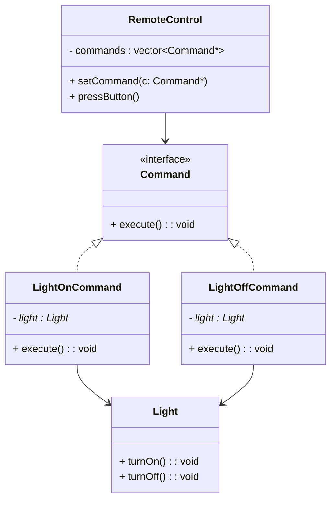

# ⚙️ Command Design Pattern
## 🎯 Intent

The Command Pattern is used to encapsulate a request as an object, allowing you to:

- Parameterize clients with different requests,
- Queue or log requests,
- Support undo/redo operations.

This pattern decouples the object that invokes the operation from the one that actually performs it.

---

## 🧩 1. Real-World Analogy

- Think of a TV remote:
- You press a button (Invoker),
- The command (e.g., “TurnOn”) is sent to the TV (Receiver),
- The TV executes the action.
- You can add new buttons (commands) without changing the remote — that's the flexibility of the Command pattern.

---

## 🧱 2. UML Class Diagram


---

## 💡 3. Structure

| Role                | Responsibility                            |
| ------------------- | ----------------------------------------- |
| **Command**         | Abstract interface defining `execute()`   |
| **ConcreteCommand** | Implements the actual operation           |
| **Receiver**        | The object that performs the action       |
| **Invoker**         | Calls the command’s `execute()`           |
| **Client**          | Creates and links commands with receivers |

---

## 🧮 4. C++ Implementation
```cpp title="command-design.cpp" linenums="1"
#include <iostream>
#include <vector>
#include <memory>
using namespace std;

// ----- Command Interface -----
class Command {
public:
    virtual void execute() = 0;
    virtual ~Command() = default;
};

// ----- Receiver -----
class Light {
public:
    void turnOn() {
        cout << "💡 Light is ON\n";
    }
    void turnOff() {
        cout << "🌑 Light is OFF\n";
    }
};

// ----- Concrete Commands -----
class LightOnCommand : public Command {
    Light* light;
public:
    LightOnCommand(Light* l) : light(l) {}
    void execute() override {
        light->turnOn();
    }
};

class LightOffCommand : public Command {
    Light* light;
public:
    LightOffCommand(Light* l) : light(l) {}
    void execute() override {
        light->turnOff();
    }
};

// ----- Invoker -----
class RemoteControl {
    vector<shared_ptr<Command>> history;
public:
    void pressButton(shared_ptr<Command> command) {
        command->execute();
        history.push_back(command); // store for possible undo/logging
    }
};

// ----- Client -----
int main() {
    Light livingRoomLight;

    auto lightOn = make_shared<LightOnCommand>(&livingRoomLight);
    auto lightOff = make_shared<LightOffCommand>(&livingRoomLight);

    RemoteControl remote;
    remote.pressButton(lightOn);
    remote.pressButton(lightOff);
}
```

---

## 🔄 5. Flow of Execution

- Client creates command objects and assigns receivers.
- Invoker (RemoteControl) calls execute() on a command.
- Command calls the receiver’s actual operation.
- Receiver performs the action.

---

## 🧠 6. Advantages

✅ Decouples sender and receiver.
✅ Makes commands reusable and composable.
✅ Supports undo/redo and logging easily.
✅ Follows Open/Closed Principle — new commands can be added without changing existing code.

---

## 💡 7. Real-World Use Cases

| System                | Example                                |
| --------------------- | -------------------------------------- |
| GUI Apps              | Menu items, buttons triggering actions |
| Game Engines          | Player actions like move, attack, jump |
| Database Transactions | Undo/redo operations                   |
| Messaging Queues      | Commands queued for later execution    |

---

## 🧩 8. Example Extension — Undo Support
```cpp title="command-design-extension.cpp" linenums="1"
class Command {
public:
    virtual void execute() = 0;
    virtual void undo() = 0;
    virtual ~Command() = default;
};
```

---

## 📘 9. References

- [Refactoring Guru – Command Pattern](https://refactoring.guru/design-patterns/command)
- [GeeksforGeeks – Command Design Pattern in C++](https://www.geeksforgeeks.org/system-design/command-pattern/)
- [SourceMaking – Command Pattern](https://sourcemaking.com/design_patterns/command)
- [Medium – Understanding Command Pattern](https://medium.com/@interviewnoodle/command-design-pattern-in-depth-63cb40b4a5e9)
