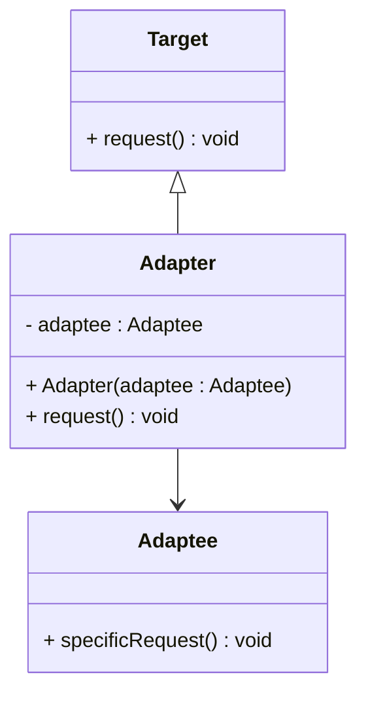

# 🧩 Adapter Design Pattern

## 📘 Overview

The **Adapter Design Pattern** is a **structural design pattern** that allows objects with incompatible interfaces to collaborate.  
It acts as a **bridge** between two incompatible interfaces — wrapping one object so that it can be used as another.

---

## 💡 Real-World Analogy

Think of a **mobile charger** — your phone’s charging port might be USB-C, but the socket is a regular plug.  
The **charger acts as an adapter** that converts electrical power from one interface to another.

---

## 🔧 Structure

- **Target** → Defines the domain-specific interface used by the client.  
- **Adaptee** → Has an existing interface that needs adapting.  
- **Adapter** → Adapts the interface of the adaptee to the target interface.  
- **Client** → Works with Target through the Adapter.

---

## 🧭 UML Diagram



---

## 💻 C++ Implementation
``` cpp
#include <iostream>
using namespace std;

// Target interface
class Target {
public:
    virtual void request() const {
        cout << "Target: Default target behavior." << endl;
    }
    virtual ~Target() = default;
};

// Adaptee with a different interface
class Adaptee {
public:
    void specificRequest() const {
        cout << "Adaptee: Specific behavior (incompatible interface)." << endl;
    }
};

// Adapter makes Adaptee compatible with Target
class Adapter : public Target {
private:
    Adaptee* adaptee;

public:
    Adapter(Adaptee* a) : adaptee(a) {}
    void request() const override {
        cout << "Adapter: Translating request -> ";
        adaptee->specificRequest();
    }
};

// Client code
int main() {
    Adaptee* adaptee = new Adaptee;
    Target* adapter = new Adapter(adaptee);

    cout << "Client: I can work with Target objects:\n";
    adapter->request();

    delete adapter;
    delete adaptee;
    return 0;
}
```

---

## 🧠 Key Points

✅ The Adapter pattern is especially useful when:

- You want to reuse existing classes with incompatible interfaces.
- You’re working with legacy code that cannot be modified.
- You need to integrate third-party libraries smoothly.

## 🔗 References

- [Refactoring Guru – Adapter Pattern](https://refactoring.guru/design-patterns/adapter)
- [GeeksforGeeks – Adapter Design Pattern in C++](https://www.geeksforgeeks.org/system-design/adapter-pattern/)
