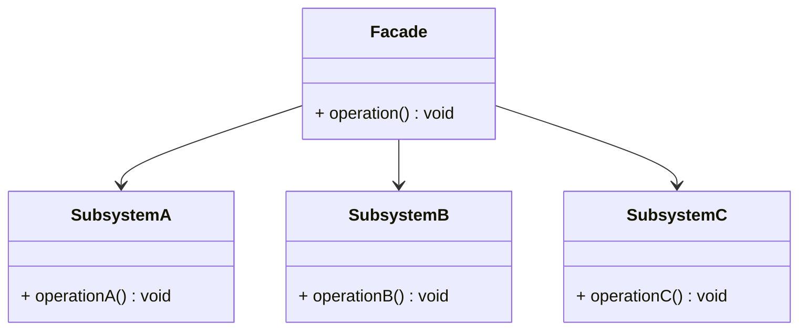

# 🧱 Facade Design Pattern

## 📘 Overview

The **Facade Design Pattern** is a **structural pattern** that provides a **simplified interface** to a complex subsystem.  
It hides the complexity of multiple classes behind a single unified interface, making the subsystem easier to use.

---

## 💡 Real-World Analogy

Imagine you're ordering food at a restaurant 🍽️.  
Instead of interacting with the **chef**, **waiters**, and **cashier** individually, you just **talk to one waiter (facade)** who handles everything behind the scenes.  
That’s the essence of the Facade pattern.

---

## 🔧 Structure

- **Facade** → Provides a simple interface to the complex subsystem.  
- **Subsystem Classes** → Implement detailed functionality but are accessed through the facade.  
- **Client** → Interacts only with the facade.

---

## 🧭 UML Diagram



---

## 💻 C++ Implementation
```cpp
#include <iostream>
using namespace std;

// Subsystem A
class SubsystemA {
public:
    void operationA() const {
        cout << "SubsystemA: Operation A executed.\n";
    }
};

// Subsystem B
class SubsystemB {
public:
    void operationB() const {
        cout << "SubsystemB: Operation B executed.\n";
    }
};

// Subsystem C
class SubsystemC {
public:
    void operationC() const {
        cout << "SubsystemC: Operation C executed.\n";
    }
};

// Facade class
class Facade {
private:
    SubsystemA* a;
    SubsystemB* b;
    SubsystemC* c;

public:
    Facade() {
        a = new SubsystemA();
        b = new SubsystemB();
        c = new SubsystemC();
    }

    ~Facade() {
        delete a;
        delete b;
        delete c;
    }

    void operation() const {
        cout << "Facade: Coordinating subsystems...\n";
        a->operationA();
        b->operationB();
        c->operationC();
    }
};

// Client code
int main() {
    Facade facade;
    facade.operation();
    return 0;
}
```

---

## 🧠 Key Points

✅ Simplifies complex systems by exposing a unified API.
✅ Reduces dependencies between client code and subsystem classes.
✅ Increases maintainability by isolating changes within subsystems.
✅ Ideal for library wrappers, SDKs, and large applications.

## ⚙️ Real-World Example

In a video conversion tool, the Facade might expose a single function convertVideo("file.mp4", "avi")
— while internally it coordinates with subsystems for file reading, codec conversion, and compression.

## 🔗 References

- [Refactoring Guru – Facade Pattern](https://refactoring.guru/design-patterns/facade)
- [GeeksforGeeks – Facade Design Pattern in C++](https://www.geeksforgeeks.org/system-design/facade-design-pattern-introduction/)
- [SourceMaking – Facade Pattern](https://sourcemaking.com/design_patterns/facade)
