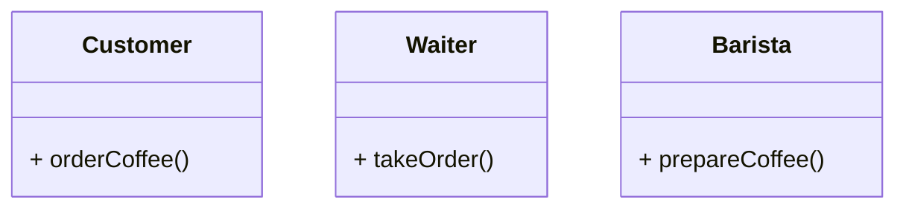

# 🧭 Principle of Least Knowledge (Law of Demeter)

## 📘 Overview

The **Principle of Least Knowledge**, also known as the **Law of Demeter**, states that:
> *"An object should only talk to its immediate friends, and not to strangers."*

In other words, **each unit should have limited knowledge about other units** — only enough to perform its job.

This principle promotes **low coupling** and **high cohesion**, improving **maintainability**, **readability**, and **testability**.

---

## 💡 Real-World Analogy

Imagine a customer ordering coffee ☕:  
The customer tells the **waiter** what they want — not the **barista** or **coffee machine** directly.  
The waiter communicates internally to fulfill the order.

> ❌ Bad: Customer → Barista → CoffeeMachine  
> ✅ Good: Customer → Waiter → (Waiter handles the rest)

---

## ⚙️ Rule of Thumb

A method of an object should only call methods of:
1. Itself  
2. Its own member variables  
3. Objects passed as parameters  
4. Objects it creates  
5. Its direct components  

Anything beyond that — like chaining method calls — **violates the principle**.

---

## 🧩 UML Diagram



---

## 💻 C++ Implementation
- ❌ Without the Principle (Tight Coupling)
```cpp title="without-law-of-demeter.cpp" linenums="1"
#include <iostream>
using namespace std;

class CoffeeMachine {
public:
    void brew() { cout << "Brewing coffee...\n"; }
};

class Barista {
public:
    CoffeeMachine machine;
};

class Customer {
public:
    void orderCoffee(Barista& barista) {
        // Violates Principle of Least Knowledge
        barista.machine.brew();
    }
};

int main() {
    Barista barista;
    Customer customer;
    customer.orderCoffee(barista);
}
```

- ✅ Applying the Principle of Least Knowledge
```cpp title="with-law-of-demeter.cpp" linenums="1"
#include <iostream>
using namespace std;

class CoffeeMachine {
public:
    void brew() { cout << "Brewing coffee...\n"; }
};

class Barista {
private:
    CoffeeMachine machine;
public:
    void makeCoffee() { machine.brew(); }
};

class Customer {
public:
    void orderCoffee(Barista& barista) {
        // Follows the principle — only interacts with Barista
        barista.makeCoffee();
    }
};

int main() {
    Barista barista;
    Customer customer;
    customer.orderCoffee(barista);
}
```

---

## 🧠 Key Takeaways
| Concept    | Description                                             |
| ---------- | ------------------------------------------------------- |
| **Goal**   | Reduce coupling and hidden dependencies                 |
| **Effect** | Improves modularity and maintainability                 |
| **Avoid**  | Long method chains like `a.getB().getC().doSomething()` |
| **Follow** | “Talk to friends, not to strangers”                     |

---

## 🧰 When to Apply

- Large systems where modules depend on each other
- To prevent "ripple effects" when a small change in one class breaks others
- When designing APIs or service boundaries

## 🔗 References

- [Refactoring Guru – Law of Demeter](https://refactoring.guru/design-patterns/law-of-demeter)
- [GeeksforGeeks – Principle of Least Knowledge](https://www.geeksforgeeks.org/principle-of-least-knowledge-law-of-demeter/)
- [SourceMaking – Law of Demeter](https://sourcemaking.com/refactoring/law-of-demeter)
