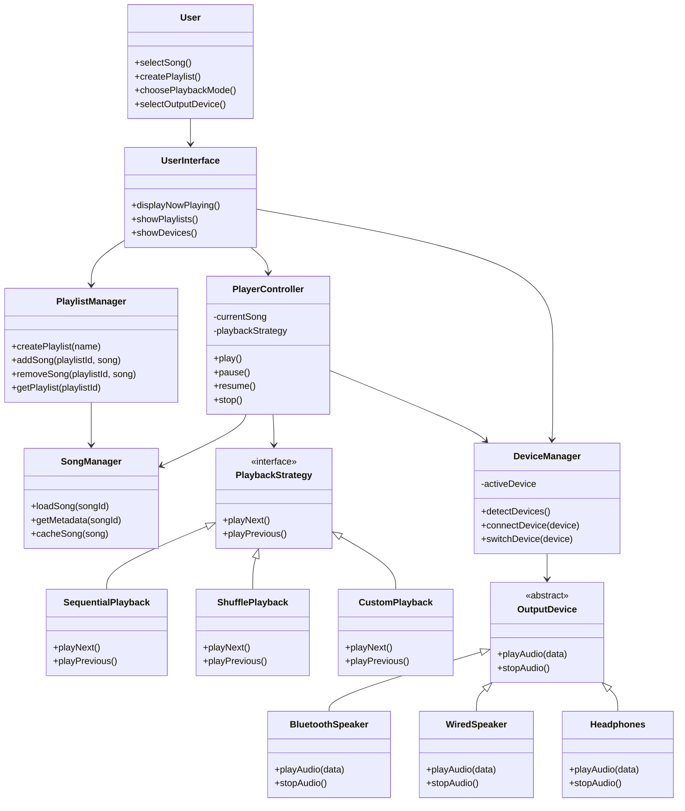

# 🎵 Music Player System Design

## **1. Overview**
A scalable and modular music player system that allows users to **play, pause, and manage songs**, create playlists, and play them in different modes. The system supports **multiple output devices** and is designed for easy feature extension.

---

## **2. Functional Requirements**

### 🎧 Core Features
1. **Play / Pause Song**  
   - User can play or pause any selected song.  
   - Support for resuming from the paused position.

2. **Playlist Management**  
   - Users can create multiple playlists.  
   - Add or remove songs from playlists.  
   - Rename or delete playlists.

3. **Playback Modes**  
   - **Sequential Mode** – Songs play in order.  
   - **Shuffle Mode** – Songs play in random order.  
   - **Custom Mode** – Users can define their own play order.

4. **Multi-Device Audio Output**  
   - Supports **Bluetooth speakers**, **wired speakers**, and **headphones**.  
   - Allows switching between devices seamlessly during playback.

---

## **3. Non-Functional Requirements**

### ⚙️ Scalability
- The architecture should allow **easy scaling** to handle more users, songs, or playlists.  
- Use **modular components** (Player, PlaylistManager, DeviceManager, etc.) to enable distributed scaling.

### 🧩 Extensibility
- **New features** (e.g., new playback modes or output devices) should be easily integrated without modifying core logic.
- Follow **Open/Closed Principle (OCP)** for code design — open for extension, closed for modification.

### 💻 Performance
- Ensure **low latency** in playback and **fast switching** between songs or devices.

### 🧠 Maintainability
- Use **clear interfaces and design patterns** (e.g., **Strategy Pattern** for playback modes, **Observer Pattern** for device state changes).

---

## **4. High-Level Design**

### 🏗️ System Components
| Component | Responsibility |
|------------|----------------|
| **Song Manager** | Handles song metadata, loading, and caching. |
| **Player Controller** | Controls play, pause, resume, and stop operations. |
| **Playlist Manager** | Manages playlists and song sequencing. |
| **Playback Strategy** | Defines different playback modes (Sequential, Shuffle, Custom). |
| **Device Manager** | Detects and manages available output devices. |
| **User Interface** | Allows user interaction and displays playback status. |

---

## **5. Design Patterns Used**
- **Strategy Pattern** → For flexible playback modes.  
- **Observer Pattern** → For device connection/disconnection updates.  
- **Factory Pattern** → For creating device objects dynamically.  
- **Facade Pattern** → For providing a unified interface to core subsystems.

---

## **6. Future Extensions**
- Integration with **cloud storage** for songs.  
- **Smart playlist recommendations** using AI.  
- **Voice command support** for controlling playback.  
- **Cross-platform support** (web, mobile, desktop).

---

## **7. Example Flow**
1. User opens app → selects playlist.  
2. System loads playlist → applies selected playback strategy.  
3. User selects output device → playback starts.  
4. User can pause/resume or switch device anytime.  

---

## **8. UML**


---

## **9. C++ Implementation**
```cpp title="music-player.cpp" linenums="1"
// music_player_design.cpp
// Simplified C++ implementation of the mermaid design for a modular music player
// Demonstrates core components: SongManager, PlaylistManager, PlaybackStrategy variants,
// PlayerController, DeviceManager and OutputDevice implementations.

#include <algorithm>
#include <chrono>
#include <functional>
#include <iostream>
#include <memory>
#include <mutex>
#include <random>
#include <string>
#include <thread>
#include <unordered_map>
#include <vector>

namespace MusicPlayer {

struct Song {
    int id;
    std::string title;
    int durationSeconds; // fake metadata
};

// Simple SongManager: stores songs and returns metadata
class SongManager {
public:
    void addSong(const Song &s) { songs_[s.id] = s; }
    Song getSong(int id) const {
        auto it = songs_.find(id);
        if (it != songs_.end()) return it->second;
        throw std::runtime_error("Song not found");
    }
private:
    std::unordered_map<int, Song> songs_;
};

// Playlist container
class Playlist {
public:
    explicit Playlist(std::string name) : name_(std::move(name)) {}
    void addSongId(int songId) { songIds_.push_back(songId); }
    void removeSongId(int songId) {
        songIds_.erase(std::remove(songIds_.begin(), songIds_.end(), songId), songIds_.end());
    }
    const std::vector<int>& getSongIds() const { return songIds_; }
    const std::string& getName() const { return name_; }
private:
    std::string name_;
    std::vector<int> songIds_;
};

class PlaylistManager {
public:
    std::shared_ptr<Playlist> createPlaylist(const std::string &name) {
        auto p = std::make_shared<Playlist>(name);
        playlists_.push_back(p);
        return p;
    }
    void deletePlaylist(const std::string &name) {
        playlists_.erase(std::remove_if(playlists_.begin(), playlists_.end(), [&](const auto &p){ return p->getName()==name; }), playlists_.end());
    }
private:
    std::vector<std::shared_ptr<Playlist>> playlists_;
};

// Output devices
class OutputDevice {
public:
    virtual ~OutputDevice() = default;
    virtual void playAudio(const Song &song) = 0; // simplified: "play" prints
    virtual void stopAudio() = 0;
    virtual std::string getName() const = 0;
};

class BluetoothSpeaker : public OutputDevice {
public:
    void playAudio(const Song &song) override {
        std::cout << "[BluetoothSpeaker] Playing: " << song.title << " (" << song.durationSeconds << "s)\n";
    }
    void stopAudio() override { std::cout << "[BluetoothSpeaker] Stopped\n"; }
    std::string getName() const override { return "Bluetooth Speaker"; }
};

class WiredSpeaker : public OutputDevice {
public:
    void playAudio(const Song &song) override {
        std::cout << "[WiredSpeaker] Playing: " << song.title << " (" << song.durationSeconds << "s)\n";
    }
    void stopAudio() override { std::cout << "[WiredSpeaker] Stopped\n"; }
    std::string getName() const override { return "Wired Speaker"; }
};

class Headphones : public OutputDevice {
public:
    void playAudio(const Song &song) override {
        std::cout << "[Headphones] Playing (private): " << song.title << " (" << song.durationSeconds << "s)\n";
    }
    void stopAudio() override { std::cout << "[Headphones] Stopped\n"; }
    std::string getName() const override { return "Headphones"; }
};

// DeviceManager: manages devices and active device
class DeviceManager {
public:
    void addDevice(std::shared_ptr<OutputDevice> d) { devices_.push_back(std::move(d)); }
    void listDevices() const {
        std::cout << "Available devices:\n";
        for (size_t i = 0; i < devices_.size(); ++i) {
            std::cout << "  [" << i << "] " << devices_[i]->getName() << "\n";
        }
    }
    bool switchTo(size_t index) {
        if (index >= devices_.size()) return false;
        activeDevice_ = devices_[index];
        std::cout << "Switched to device: " << activeDevice_->getName() << "\n";
        return true;
    }
    std::shared_ptr<OutputDevice> getActiveDevice() const { return activeDevice_; }
private:
    std::vector<std::shared_ptr<OutputDevice>> devices_;
    std::shared_ptr<OutputDevice> activeDevice_;
};

// PlaybackStrategy interface
class PlaybackStrategy {
public:
    virtual ~PlaybackStrategy() = default;
    virtual void setPlaylist(const std::vector<int> &songIds) = 0;
    virtual int getCurrentSongId() = 0; // returns -1 if none
    virtual int next() = 0; // advances and returns new song id or -1
    virtual int previous() = 0;
    virtual void reset() = 0;
};

// Sequential playback
class SequentialPlayback : public PlaybackStrategy {
public:
    void setPlaylist(const std::vector<int> &songIds) override { order_ = songIds; pos_ = 0; }
    int getCurrentSongId() override { if (order_.empty() || pos_ >= order_.size()) return -1; return order_[pos_]; }
    int next() override { if (pos_ + 1 < order_.size()) ++pos_; else pos_ = order_.size(); return getCurrentSongId(); }
    int previous() override { if (pos_ == 0) return getCurrentSongId(); --pos_; return getCurrentSongId(); }
    void reset() override { pos_ = 0; }
private:
    std::vector<int> order_;
    size_t pos_ = 0;
};

// Shuffle playback
class ShufflePlayback : public PlaybackStrategy {
public:
    void setPlaylist(const std::vector<int> &songIds) override {
        original_ = songIds;
        order_ = songIds;
        std::random_device rd;
        std::mt19937 g(rd());
        std::shuffle(order_.begin(), order_.end(), g);
        pos_ = 0;
    }
    int getCurrentSongId() override { if (order_.empty() || pos_ >= order_.size()) return -1; return order_[pos_]; }
    int next() override { if (pos_ + 1 < order_.size()) ++pos_; else pos_ = order_.size(); return getCurrentSongId(); }
    int previous() override { if (pos_ == 0) return getCurrentSongId(); --pos_; return getCurrentSongId(); }
    void reset() override { pos_ = 0; std::random_device rd; std::mt19937 g(rd()); std::shuffle(order_.begin(), order_.end(), g); }
private:
    std::vector<int> original_;
    std::vector<int> order_;
    size_t pos_ = 0;
};

// Custom playback: user provides a custom order
class CustomPlayback : public PlaybackStrategy {
public:
    explicit CustomPlayback(const std::vector<int> &customOrder = {}) { order_ = customOrder; pos_ = 0; }
    void setPlaylist(const std::vector<int> &songIds) override {
        // If custom order was given and matches the songIds set, keep it. Otherwise default to given list.
        // For simplicity we default to songIds if custom order is empty.
        if (order_.empty()) { order_ = songIds; }
        pos_ = 0;
    }
    int getCurrentSongId() override { if (order_.empty() || pos_ >= order_.size()) return -1; return order_[pos_]; }
    int next() override { if (pos_ + 1 < order_.size()) ++pos_; else pos_ = order_.size(); return getCurrentSongId(); }
    int previous() override { if (pos_ == 0) return getCurrentSongId(); --pos_; return getCurrentSongId(); }
    void reset() override { pos_ = 0; }
private:
    std::vector<int> order_;
    size_t pos_ = 0;
};

// PlayerController: orchestrates playback
class PlayerController {
public:
    PlayerController(const SongManager &sm, DeviceManager &dm) : songManager_(sm), deviceManager_(dm) {}

    void setPlaybackStrategy(std::unique_ptr<PlaybackStrategy> strat) {
        std::lock_guard<std::mutex> lock(m_);
        playbackStrategy_ = std::move(strat);
        if (currentPlaylist_) playbackStrategy_->setPlaylist(currentPlaylist_->getSongIds());
    }

    void loadPlaylist(std::shared_ptr<Playlist> p) {
        std::lock_guard<std::mutex> lock(m_);
        currentPlaylist_ = std::move(p);
        if (playbackStrategy_) playbackStrategy_->setPlaylist(currentPlaylist_->getSongIds());
    }

    void play() {
        std::lock_guard<std::mutex> lock(m_);
        if (!playbackStrategy_) { std::cerr << "No playback strategy set\n"; return; }
        if (!deviceManager_.getActiveDevice()) { std::cerr << "No active device selected\n"; return; }
        int id = playbackStrategy_->getCurrentSongId();
        if (id == -1) { std::cerr << "Nothing to play\n"; return; }
        Song s = songManager_.getSong(id);
        playing_ = true;
        std::cout << "-> Playing: " << s.title << "\n";
        deviceManager_.getActiveDevice()->playAudio(s);
        // NOTE: we do not actually stream audio; we simulate playing via thread sleep for demonstration
        playThread_ = std::thread([this, s]() {
            std::this_thread::sleep_for(std::chrono::milliseconds(std::min(2000, s.durationSeconds*1000)));
            // when finished, auto-advance
            std::lock_guard<std::mutex> lock(m_);
            if (playing_) {
                int nextId = playbackStrategy_->next();
                if (nextId != -1) {
                    // play next automatically
                    Song nextSong = songManager_.getSong(nextId);
                    std::cout << "-> Auto-advancing to: " << nextSong.title << "\n";
                    deviceManager_.getActiveDevice()->playAudio(nextSong);
                } else {
                    std::cout << "Playlist finished\n";
                    deviceManager_.getActiveDevice()->stopAudio();
                    playing_ = false;
                }
            }
        });
        if (playThread_.joinable()) playThread_.detach();
    }

    void pause() {
        std::lock_guard<std::mutex> lock(m_);
        if (!playing_) { std::cerr << "Nothing is playing\n"; return; }
        playing_ = false;
        if (deviceManager_.getActiveDevice()) deviceManager_.getActiveDevice()->stopAudio();
        std::cout << "Paused\n";
    }

    void next() {
        std::lock_guard<std::mutex> lock(m_);
        if (!playbackStrategy_) return;
        int id = playbackStrategy_->next();
        if (id == -1) { std::cout << "End of playlist\n"; return; }
        Song s = songManager_.getSong(id);
        if (deviceManager_.getActiveDevice()) deviceManager_.getActiveDevice()->playAudio(s);
        playing_ = true;
    }

    void previous() {
        std::lock_guard<std::mutex> lock(m_);
        if (!playbackStrategy_) return;
        int id = playbackStrategy_->previous();
        if (id == -1) return;
        Song s = songManager_.getSong(id);
        if (deviceManager_.getActiveDevice()) deviceManager_.getActiveDevice()->playAudio(s);
        playing_ = true;
    }

private:
    const SongManager &songManager_;
    DeviceManager &deviceManager_;
    std::unique_ptr<PlaybackStrategy> playbackStrategy_;
    std::shared_ptr<Playlist> currentPlaylist_;
    bool playing_ = false;
    std::thread playThread_;
    std::mutex m_;
};

// Simple text-based UI demo
class UserInterface {
public:
    UserInterface(PlayerController &pc, DeviceManager &dm, PlaylistManager &pm) : player_(pc), deviceManager_(dm), playlistManager_(pm) {}
    void showDevices() { deviceManager_.listDevices(); }
    void showPlaylists() { std::cout << "(Playlists listing is available via PlaylistManager)\n"; }
private:
    PlayerController &player_;
    DeviceManager &deviceManager_;
    PlaylistManager &playlistManager_;
};

} // namespace MusicPlayer

// ------------------------
// Example usage (main)
// ------------------------
int main() {
    using namespace MusicPlayer;

    SongManager songManager;
    songManager.addSong({1, "Song A", 3});
    songManager.addSong({2, "Song B", 4});
    songManager.addSong({3, "Song C", 5});

    PlaylistManager playlistManager;
    auto pl = playlistManager.createPlaylist("My Favs");
    pl->addSongId(1);
    pl->addSongId(2);
    pl->addSongId(3);

    DeviceManager deviceManager;
    deviceManager.addDevice(std::make_shared<BluetoothSpeaker>());
    deviceManager.addDevice(std::make_shared<WiredSpeaker>());
    deviceManager.addDevice(std::make_shared<Headphones>());
    deviceManager.listDevices();
    deviceManager.switchTo(0); // bluetooth

    PlayerController controller(songManager, deviceManager);

    // Sequential playback
    controller.setPlaybackStrategy(std::make_unique<SequentialPlayback>());
    controller.loadPlaylist(pl);

    controller.play();
    std::this_thread::sleep_for(std::chrono::seconds(1));
    controller.pause();

    // switch device while paused
    deviceManager.switchTo(2); // headphones

    controller.play();

    // demonstrate shuffle
    controller.setPlaybackStrategy(std::make_unique<ShufflePlayback>());
    controller.loadPlaylist(pl);
    controller.play();

    // keep main alive briefly to let threads print
    std::this_thread::sleep_for(std::chrono::seconds(3));
    return 0;
}
```

---

## **📌 Summary:**  
This design focuses on modularity, scalability, and extensibility — allowing easy integration of new features (like new devices or play modes) without reworking the core architecture.
