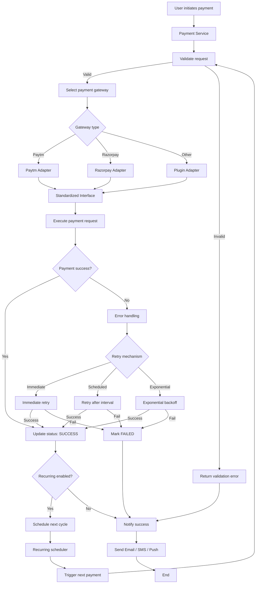

# 🧾 Payment Gateway System Design
## 📘 Overview

The Payment Gateway System is designed to support multiple payment providers such as Paytm, Razorpay, and others, following a standardized payment flow.
It ensures scalability, robust error handling, and retry mechanisms, with the ability to easily integrate new payment gateways and recurring payment flows in the future.

---

## 🎯 Design Goals

**1. Multi-Provider Support**

- Integrate multiple payment gateways (e.g., Paytm, Razorpay, Stripe, etc.).
- Allow new providers to be added seamlessly without modifying the core logic.

**2. Standardized Payment Flow**

- All gateways follow a unified interface and workflow.
- Includes validations, retries, and notification mechanisms.

**3. Error Handling & Retry Mechanism**

- Automatically handle transient errors with configurable retry strategies.
- Supports multiple retry types (immediate, scheduled, exponential backoff).

**4. Extensibility**

- Easily add new gateways through a plug-and-play design using the Adapter pattern.

**5. Recurring Payments**

- Support automated recurring transactions using schedulers or cron-based triggers.

---

🔁 Standardized Payment Flow

**1. User initiates payment** → through frontend / API.

**2. Validation** → amount, currency, and provider.

**3. Select gateway** → based on provider name or configuration.

**4. Execute payment** → through the unified interface.

**5. Check response:**

 - If success → mark transaction as SUCCESS.
 - If failure → invoke retry mechanism.

**6. Retry logic executes until:**

 - Success achieved.
 - Retry attempts exhausted.

**7. Update transaction status** in DB.

**8. Send notification** to the user.

**9. If recurring payment enabled** → schedule next cycle.

---

## ⚙️ Retry Strategies
| Type                    | Description                                                      | Example Use Case                              |
| ----------------------- | ---------------------------------------------------------------- | --------------------------------------------- |
| **Immediate Retry**     | Retry instantly after a failure (up to N attempts).              | Temporary network glitch.                     |
| **Scheduled Retry**     | Retry after a fixed interval (e.g., every 5 mins).               | Payment gateway downtime.                     |
| **Exponential Backoff** | Retry with exponentially increasing delays (e.g., 1s → 2s → 4s). | Unstable gateway response or network latency. |

---

## 🧠 Design Patterns Used
| Pattern                                    | Purpose                                                                           |
| ------------------------------------------ | --------------------------------------------------------------------------------- |
| **Adapter Pattern**                        | To integrate multiple payment gateways with a uniform interface.                  |
| **Strategy Pattern**                       | To allow flexible retry mechanisms without changing core logic.                   |
| **Observer Pattern (Notification System)** | To notify users asynchronously after payment events.                              |
| **Template Method Pattern**                | To define a standard payment flow with overridable steps for different providers. |

---

## UML 


---

## C++ Implementation
```cpp title="payment-gateway.cpp" linenums="1"
// payment_system.cpp
// Compile: g++ -std=c++17 payment_system.cpp -pthread -O2 -o payment_system
#include <bits/stdc++.h>
#include <thread>
#include <chrono>
#include <random>
#include <atomic>

using namespace std::chrono_literals;
using namespace std;

/* -------------------- Basic Types -------------------- */

enum class PaymentStatus { SUCCESS, FAILED, PENDING };
struct PaymentRequest {
    string id;
    string provider;     // "paytm", "razorpay", etc.
    double amount;
    string currency;
    string userId;
    bool recurring = false;
    int remainingCycles = 0; // used for recurring demo
};

struct PaymentResponse {
    PaymentStatus status;
    string providerTxId;
    string message;
};

/* -------------------- Payment Gateway Interface & Adapters -------------------- */

class PaymentGateway {
public:
    virtual PaymentResponse process(const PaymentRequest &req) = 0;
    virtual string name() const = 0;
    virtual ~PaymentGateway() = default;
};

// Simulate randomness for provider success/failure
static std::mt19937_64 rng((uint64_t)std::chrono::high_resolution_clock::now().time_since_epoch().count());

class PaytmAdapter : public PaymentGateway {
public:
    PaymentResponse process(const PaymentRequest &req) override {
        // Simulate a 75% success rate
        std::uniform_real_distribution<double> dist(0.0, 1.0);
        double v = dist(rng);
        if (v < 0.75) {
            return {PaymentStatus::SUCCESS, "PAYTM-" + req.id + "-" + std::to_string((int)(v*10000)), "OK"};
        } else {
            return {PaymentStatus::FAILED, "", "Paytm: transient error"};
        }
    }
    string name() const override { return "paytm"; }
};

class RazorpayAdapter : public PaymentGateway {
public:
    PaymentResponse process(const PaymentRequest &req) override {
        // Simulate 65% success + 10% permanent failure
        std::uniform_real_distribution<double> dist(0.0, 1.0);
        double v = dist(rng);
        if (v < 0.65) {
            return {PaymentStatus::SUCCESS, "RAZOR-" + req.id + "-" + std::to_string((int)(v*10000)), "OK"};
        } else if (v < 0.75) {
            return {PaymentStatus::FAILED, "", "Razorpay: permanent rejection (insufficient funds)"};
        } else {
            return {PaymentStatus::FAILED, "", "Razorpay: transient network issue"};
        }
    }
    string name() const override { return "razorpay"; }
};

/* -------------------- Retry Strategy Pattern -------------------- */

class RetryStrategy {
public:
    virtual bool shouldRetry(int attempt, const PaymentResponse &lastResponse) = 0;
    virtual std::chrono::milliseconds nextDelay(int attempt) = 0;
    virtual ~RetryStrategy() = default;
};

class ImmediateRetryStrategy : public RetryStrategy {
    int maxAttempts;
public:
    ImmediateRetryStrategy(int maxAttempts_ = 3) : maxAttempts(maxAttempts_) {}
    bool shouldRetry(int attempt, const PaymentResponse &lastResponse) override {
        return attempt < maxAttempts;
    }
    chrono::milliseconds nextDelay(int attempt) override {
        return 0ms;
    }
};

class ScheduledRetryStrategy : public RetryStrategy {
    int maxAttempts;
    chrono::milliseconds interval;
public:
    ScheduledRetryStrategy(int maxAttempts_, chrono::milliseconds interval_) : maxAttempts(maxAttempts_), interval(interval_) {}
    bool shouldRetry(int attempt, const PaymentResponse &lastResponse) override {
        return attempt < maxAttempts;
    }
    chrono::milliseconds nextDelay(int attempt) override {
        return interval;
    }
};

class ExponentialBackoffStrategy : public RetryStrategy {
    int maxAttempts;
    chrono::milliseconds baseDelay;
public:
    ExponentialBackoffStrategy(int maxAttempts_, chrono::milliseconds baseDelay_ = 200ms) : maxAttempts(maxAttempts_), baseDelay(baseDelay_) {}
    bool shouldRetry(int attempt, const PaymentResponse &lastResponse) override {
        return attempt < maxAttempts;
    }
    chrono::milliseconds nextDelay(int attempt) override {
        // attempt starts from 1
        long long factor = 1LL << (attempt - 1);
        auto ms = baseDelay.count() * factor;
        if (ms > 5000) ms = 5000; // cap 5s for demo
        return chrono::milliseconds(ms);
    }
};

/* -------------------- Notification Service (stub) -------------------- */

class NotificationService {
public:
    void notifySuccess(const PaymentRequest &req, const PaymentResponse &resp) {
        cout << "[Notification] Payment " << req.id << " succeeded via " << req.provider
             << " tx=" << resp.providerTxId << " amount=" << req.amount << " " << req.currency << "\n";
    }
    void notifyFailure(const PaymentRequest &req, const PaymentResponse &resp) {
        cout << "[Notification] Payment " << req.id << " FAILED via " << req.provider
             << " reason=\"" << resp.message << "\"\n";
    }
};

/* -------------------- Payment Service (Standardized flow) -------------------- */

class PaymentService {
    unordered_map<string, shared_ptr<PaymentGateway>> providers;
    shared_ptr<RetryStrategy> retryStrategy;
    NotificationService notifier;

public:
    PaymentService(shared_ptr<RetryStrategy> strat) : retryStrategy(strat) {}

    void registerProvider(shared_ptr<PaymentGateway> gateway) {
        providers[gateway->name()] = gateway;
    }

    // Basic validation
    bool validate(const PaymentRequest &req, string &err) {
        if (req.amount <= 0) { err = "amount must be > 0"; return false; }
        if (req.currency.empty()) { err = "currency missing"; return false; }
        if (req.userId.empty()) { err = "userId missing"; return false; }
        if (providers.find(req.provider) == providers.end()) { err = "unknown provider"; return false; }
        return true;
    }

    PaymentResponse executeWithRetries(const PaymentRequest &req) {
        auto gw = providers.at(req.provider);
        int attempt = 0;
        PaymentResponse lastResp{PaymentStatus::PENDING, "", "not attempted"};
        while (true) {
            attempt++;
            cout << "[PaymentService] Attempt " << attempt << " for payment " << req.id << " via " << gw->name() << "\n";

            // Call provider
            lastResp = gw->process(req);

            if (lastResp.status == PaymentStatus::SUCCESS) {
                cout << "[PaymentService] Provider returned SUCCESS on attempt " << attempt << "\n";
                return lastResp;
            }

            // Provider returned FAILED - consult retry strategy
            if (!retryStrategy->shouldRetry(attempt, lastResp)) {
                cout << "[PaymentService] Retry exhausted after attempt " << attempt << ". Last error: " << lastResp.message << "\n";
                return lastResp;
            }

            auto delay = retryStrategy->nextDelay(attempt);
            cout << "[PaymentService] Will retry after " << delay.count() << "ms\n";
            if (delay.count() > 0) std::this_thread::sleep_for(delay);
        }
    }

    // High-level standardized flow for a single payment request
    void processPayment(PaymentRequest req) {
        cout << "=== Processing Payment id=" << req.id << " provider=" << req.provider << " amount=" << req.amount << " ===\n";
        string err;
        if (!validate(req, err)) {
            cout << "[PaymentService] Validation failed: " << err << "\n";
            PaymentResponse resp{PaymentStatus::FAILED, "", "validation error: " + err};
            notifier.notifyFailure(req, resp);
            return;
        }

        PaymentResponse resp = executeWithRetries(req);

        if (resp.status == PaymentStatus::SUCCESS) {
            // Update status (DB write would happen here)
            notifier.notifySuccess(req, resp);
        } else {
            notifier.notifyFailure(req, resp);
        }
    }
};

/* -------------------- Recurring Scheduler (simple demo) -------------------- */

class RecurringScheduler {
    PaymentService &svc;
    std::atomic<bool> running { true };
    vector<PaymentRequest> scheduled; // shallow - copies are fine for demo
    mutex mtx;
    thread worker;

public:
    RecurringScheduler(PaymentService &svc_) : svc(svc_) {}

    ~RecurringScheduler() {
        stop();
    }

    void start() {
        worker = thread([this]() { this->runLoop(); });
    }

    void stop() {
        running = false;
        if (worker.joinable()) worker.join();
    }

    // schedule a recurring payment: cycles = number of times including initial
    void scheduleRecurring(const PaymentRequest &req) {
        lock_guard<mutex> lk(mtx);
        scheduled.push_back(req);
    }

private:
    void runLoop() {
        // For demo: we'll run limited cycles and short intervals.
        while (running) {
            vector<PaymentRequest> toRun;
            {
                lock_guard<mutex> lk(mtx);
                toRun = scheduled; // copy
                // remove those with 0 cycles after picking them; update remainingCycles
                scheduled.clear();
                for (auto &r : toRun) {
                    if (r.remainingCycles > 0) r.remainingCycles--;
                }
            }

            if (!toRun.empty()) {
                for (auto &r : toRun) {
                    // Process one cycle
                    svc.processPayment(r);

                    // If still cycles left, re-schedule after a short demo interval
                    if (r.remainingCycles > 0) {
                        // in real system we'd compute next execution time and persist; here we re-add to scheduled
                        lock_guard<mutex> lk(mtx);
                        scheduled.push_back(r);
                    } else {
                        cout << "[Scheduler] Completed recurring cycles for payment " << r.id << "\n";
                    }
                }
            }

            // Demo interval between scheduler ticks
            std::this_thread::sleep_for(700ms);

            // Stopping condition for demo: when no scheduled tasks remain
            {
                lock_guard<mutex> lk(mtx);
                if (scheduled.empty()) {
                    // Wait one more tick and then stop automatically (for demo)
                    std::this_thread::sleep_for(300ms);
                    running = false;
                }
            }
        }
        cout << "[Scheduler] Exiting scheduler loop\n";
    }
};

/* -------------------- Demo / Example usage -------------------- */

int main() {
    ios::sync_with_stdio(false);
    cin.tie(nullptr);

    // Choose retry strategy for PaymentService
    // You can swap between ImmediateRetryStrategy, ScheduledRetryStrategy, ExponentialBackoffStrategy
    auto retryStrategy = make_shared<ExponentialBackoffStrategy>(4, 150ms);
    PaymentService paymentService(retryStrategy);

    // Register providers
    paymentService.registerProvider(make_shared<PaytmAdapter>());
    paymentService.registerProvider(make_shared<RazorpayAdapter>());

    // Non-recurring example
    PaymentRequest p1;
    p1.id = "txn-1001";
    p1.provider = "paytm";
    p1.amount = 199.99;
    p1.currency = "INR";
    p1.userId = "user-42";
    p1.recurring = false;

    paymentService.processPayment(p1);

    // Recurring example: 3 cycles total (initial + 2 more)
    PaymentRequest rp;
    rp.id = "rec-2001";
    rp.provider = "razorpay";
    rp.amount = 49.99;
    rp.currency = "INR";
    rp.userId = "user-77";
    rp.recurring = true;
    rp.remainingCycles = 3; // number of times to attempt for demo

    RecurringScheduler scheduler(paymentService);
    scheduler.scheduleRecurring(rp);
    scheduler.start();

    // Wait for scheduler to finish its demo run
    while (true) {
        // Keep main alive until scheduler exits (demo)
        std::this_thread::sleep_for(200ms);
        break;
    }

    // join and cleanup
    scheduler.stop();

    cout << "=== Demo finished ===\n";
    return 0;
}
```

---

## ✅ Summary
| Feature                           | Supported |
| --------------------------------- | --------- |
| Multiple Gateways                 | ✔️        |
| Standardized Payment Flow         | ✔️        |
| Error Handling                    | ✔️        |
| Retry Strategies                  | ✔️        |
| Recurring Payments                | ✔️        |
| Extensibility (Add New Providers) | ✔️        |
| Notifications                     | ✔️        |
| Future Scalability                | ✔️        |
