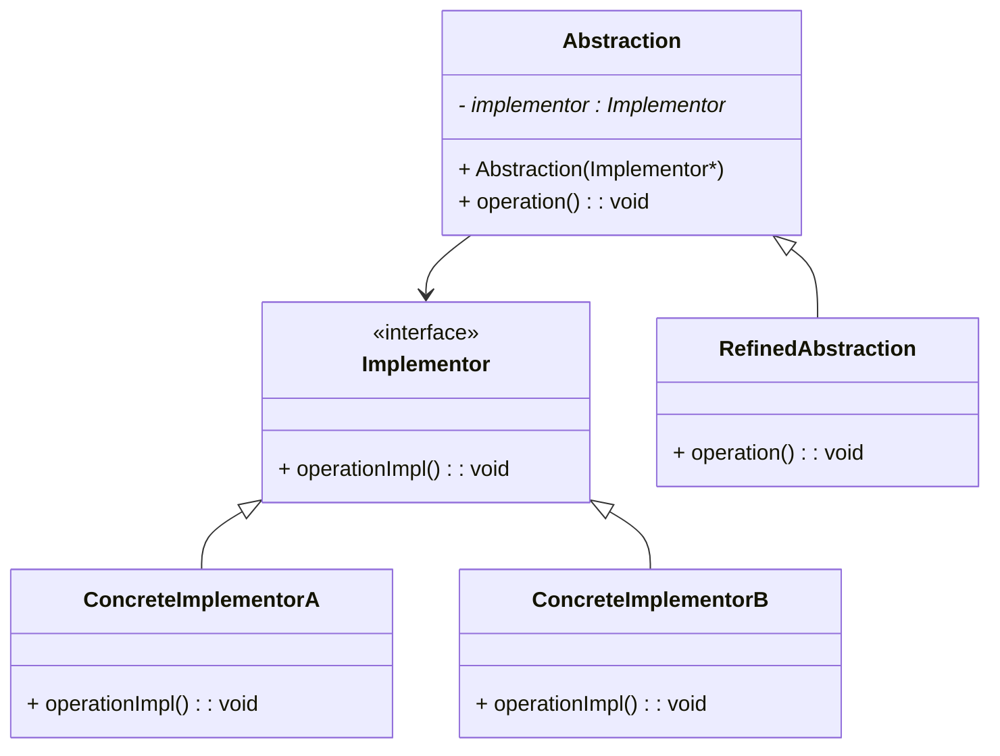

# 🌉 Bridge Design Pattern

The **Bridge Pattern** is a **structural design pattern** that decouples an abstraction from its implementation so that the two can vary independently.

It’s used when:

- You want to avoid a **permanent binding** between an abstraction and its implementation.

- You expect both abstraction and implementation to **change independently** over time.

---

## 🧩 Key Concepts

- **Abstraction**: Defines the high-level control logic and relies on the implementation for low-level details.
- **Implementor**: Defines the interface for implementation classes.
- **Refined Abstraction**: Extends the interface defined by the Abstraction.
- **Concrete Implementor**: Implements the Implementor interface.

---

## 📊 UML Diagram



---

## 💻 C++ Implementation
```cpp
#include <iostream>
using namespace std;

// Implementor Interface
class Implementor {
public:
    virtual void operationImpl() = 0;
    virtual ~Implementor() = default;
};

// Concrete Implementors
class ConcreteImplementorA : public Implementor {
public:
    void operationImpl() override {
        cout << "ConcreteImplementorA: Executing operation\n";
    }
};

class ConcreteImplementorB : public Implementor {
public:
    void operationImpl() override {
        cout << "ConcreteImplementorB: Performing different operation\n";
    }
};

// Abstraction
class Abstraction {
protected:
    Implementor* implementor;
public:
    Abstraction(Implementor* imp) : implementor(imp) {}
    virtual void operation() {
        implementor->operationImpl();
    }
    virtual ~Abstraction() = default;
};

// Refined Abstraction
class RefinedAbstraction : public Abstraction {
public:
    RefinedAbstraction(Implementor* imp) : Abstraction(imp) {}
    void operation() override {
        cout << "RefinedAbstraction: Delegating to Implementor -> ";
        implementor->operationImpl();
    }
};

// Client Code
int main() {
    ConcreteImplementorA implA;
    ConcreteImplementorB implB;

    RefinedAbstraction abstractionA(&implA);
    RefinedAbstraction abstractionB(&implB);

    abstractionA.operation();
    abstractionB.operation();

    return 0;
}
```

---

## 🧠 Output:
```vbnet
RefinedAbstraction: Delegating to Implementor -> ConcreteImplementorA: Executing operation
RefinedAbstraction: Delegating to Implementor -> ConcreteImplementorB: Performing different operation
```

---

## 🏗️ Real-world Analogy

Imagine a remote control (abstraction) that can work with different types of devices (implementations):

- The remote can send signals like "power on" or "volume up".
- The device could be a TV, speaker, or projector.

Both remotes and devices can evolve independently — that’s the power of the Bridge Pattern.

---

## 🧭 Summary
| Concept          | Description                                                              |
| ---------------- | ------------------------------------------------------------------------ |
| **Pattern Type** | Structural                                                               |
| **Purpose**      | Decouple abstraction from implementation                                 |
| **Use Case**     | When both abstraction and implementation should vary independently       |
| **Examples**     | GUI toolkit supporting multiple OS platforms, device-driver abstractions |

---

## 🔗 References

- [Refactoring.Guru – Bridge Pattern](https://refactoring.guru/design-patterns/bridge)
- [SourceMaking – Bridge Pattern](https://sourcemaking.com/design_patterns/bridge)
