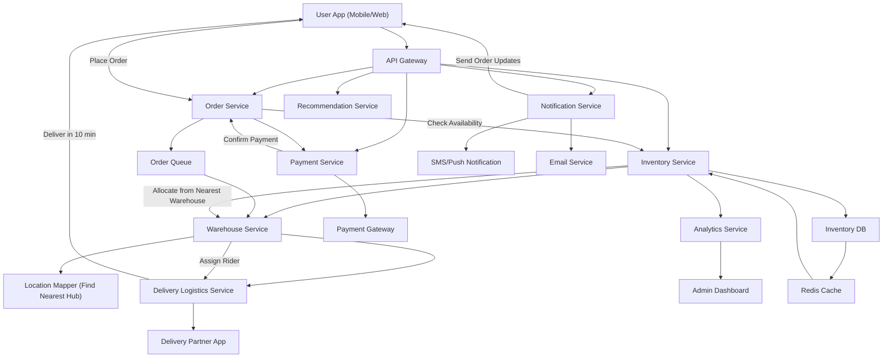

# 🏪 Zepto | 10-Minute Quick Commerce | Inventory Management | System Design
## 🚀 Overview

A 10-minute delivery system like Zepto requires a tightly coupled ecosystem of microservices, optimized inventory distribution, and real-time order orchestration.
This design focuses on scalability, availability, and low-latency response through efficient service communication and caching.

---

## 🧠 Core Idea

Deliver essential goods within 10 minutes by connecting:

- Local dark stores (warehouses)
- Nearby delivery partners
- Real-time inventory
- Smart routing & order allocation

## ⚙️ Key Components
**1. User App**
- Allows users to browse inventory, add to cart, and place orders.
- Tracks order status and estimated delivery time.
= Communicates with backend via API Gateway.

**2. API Gateway**
- Central entry point for all client requests.
- Routes requests to appropriate microservices (Order, Inventory, Payment, etc.).
- Handles authentication, rate limiting, and request aggregation.

**3. Order Service**
- Manages order lifecycle: creation, validation, and coordination.
- Validates inventory and triggers payment.
- Updates status to Notification Service and Delivery Service.
- Stores order metadata for analytics.

**4. Inventory Service**
- Tracks product availability across warehouses.
- Provides instant availability checks using Redis cache.
- Updates inventory in real time after order allocation.
- Syncs periodically with Warehouse Service.

**5. Warehouse Service**
- Represents dark stores (micro-warehouses).
- Handles product restocking, stock transfers, and expiry checks.
- Collaborates with Location Mapper to identify nearest fulfillment hub.

**6. Location Mapper**
- Maps customer delivery address to nearest active warehouse.
- Uses geo-coordinates or pincode mapping for minimal delivery latency.
- Balances load among nearby warehouses.

**7. Payment Service**
- Processes payments securely via third-party gateways.
- Handles transaction retries, refunds, and payment status updates.
- Notifies Order Service once payment succeeds or fails.

**8. Delivery Logistics Service**
- Assigns delivery partner (rider) from nearest hub.
- Optimizes route planning and expected delivery time.
- Tracks delivery progress and updates customer in real-time.

**9. Notification Service**
- Sends updates via SMS, Email, or Push Notifications.
- Triggered by order, payment, or delivery events.
- Uses asynchronous messaging queues for reliability.

**10. Analytics & Dashboard**
- Aggregates data from all services for business insights.
- Tracks order metrics, delivery time, and stock movement.
- Provides Admins a real-time monitoring dashboard.

---

## UML 


---

## C++ Implementation
```cpp
// zepto_sim.cpp
// Simulates a Zepto-like 10-min quick commerce inventory/order flow.
// Compile: g++ -std=c++17 zepto_sim.cpp -pthread -O2 -o zepto_sim
// Run: ./zepto_sim

#include <bits/stdc++.h>
#include <atomic>
#include <thread>
#include <mutex>
#include <condition_variable>
using namespace std::chrono_literals;
using namespace std;

/*
 Components mapping to Mermaid:
 - API Gateway -> main() (client calls)
 - OrderService -> OrderService class
 - InventoryService -> InventoryService class
 - WarehouseService -> WarehouseService class
 - PaymentService -> PaymentService class
 - DeliveryLogistics -> DeliveryService class
 - NotificationService -> NotificationService class
 - Analytics/Cache are simplified (we show Redis-like cache as quick lookup)
*/

// Utility
static std::atomic<int> GLOBAL_ORDER_ID{1};
std::string now() {
    auto t = std::chrono::system_clock::now();
    std::time_t tt = std::chrono::system_clock::to_time_t(t);
    char buf[32];
    std::strftime(buf, sizeof(buf), "%H:%M:%S", std::localtime(&tt));
    return std::string(buf);
}

struct Item {
    string sku;
    string name;
};

// Notification Service (prints out updates)
class NotificationService {
public:
    void notifyCustomer(int orderId, const string& msg) {
        std::lock_guard<std::mutex> lk(mu_);
        cout << "[" << now() << "] [NotificationService] Order#" << orderId << " - " << msg << "\n";
    }
private:
    std::mutex mu_;
};

// Payment Service (simulate payment gateway)
class PaymentService {
public:
    bool processPayment(int orderId, double amount) {
        cout << "[" << now() << "] [PaymentService] Processing payment for Order#" << orderId
             << " Amount: " << amount << "\n";
        // simulate network delay
        std::this_thread::sleep_for(std::chrono::milliseconds(150 + rand()%200));
        bool success = (rand() % 100) < 95; // 95% success
        cout << "[" << now() << "] [PaymentService] Payment " << (success ? "SUCCESS" : "FAILED")
             << " for Order#" << orderId << "\n";
        return success;
    }
};

// Warehouse (dark store) with stock
struct Warehouse {
    string id;
    string location; // friendly name
    unordered_map<string,int> stock; // sku -> qty
    Warehouse(const string& i, const string& loc): id(i), location(loc) {}
};

class InventoryService {
public:
    InventoryService() {}

    // add warehouse
    void addWarehouse(shared_ptr<Warehouse> wh) {
        std::lock_guard<std::mutex> lk(mu_);
        warehouses_.push_back(wh);
        // fill cache for quick lookup (sum of stocks)
        rebuildCache();
    }

    // check availability: returns vector of warehouses that can fulfill quantity
    vector<shared_ptr<Warehouse>> findWarehouses(const string& sku, int qty) {
        std::lock_guard<std::mutex> lk(mu_);
        vector<shared_ptr<Warehouse>> res;
        for (auto &wh : warehouses_) {
            auto it = wh->stock.find(sku);
            if (it != wh->stock.end() && it->second >= qty)
                res.push_back(wh);
        }
        return res;
    }

    // allocate sku from specific warehouse (reduce stock)
    bool allocateFromWarehouse(shared_ptr<Warehouse> wh, const string& sku, int qty) {
        std::lock_guard<std::mutex> lk(mu_);
        auto it = wh->stock.find(sku);
        if (it == wh->stock.end() || it->second < qty) return false;
        it->second -= qty;
        // update cache
        cache_[sku] -= qty;
        if (cache_[sku] < 0) cache_[sku] = 0;
        cout << "[" << now() << "] [InventoryService] Allocated " << qty << " of " << sku
             << " from Warehouse[" << wh->id << "]\n";
        return true;
    }

    // quick availability check via 'cache' (simulated Redis)
    int availableCache(const string& sku) {
        std::lock_guard<std::mutex> lk(mu_);
        return cache_.count(sku)? cache_[sku] : 0;
    }

    void rebuildCache() {
        cache_.clear();
        for (auto &wh : warehouses_) {
            for (auto &p : wh->stock) cache_[p.first] += p.second;
        }
    }

    vector<shared_ptr<Warehouse>> getAllWarehouses() {
        std::lock_guard<std::mutex> lk(mu_);
        return warehouses_;
    }

private:
    vector<shared_ptr<Warehouse>> warehouses_;
    unordered_map<string,int> cache_;
    std::mutex mu_;
};

// Delivery service: assign rider and simulate delivery
class DeliveryService {
public:
    DeliveryService(NotificationService& notifier): notifier_(notifier) {}

    void assignAndDeliver(int orderId, const string& customer, shared_ptr<Warehouse> wh) {
        // simulate assignment
        cout << "[" << now() << "] [DeliveryService] Assigning rider for Order#" << orderId
             << " from Warehouse[" << wh->id << "]\n";
        notifier_.notifyCustomer(orderId, "Rider assigned. Picking up from " + wh->location);
        // simulate rider pickup & transit
        std::this_thread::sleep_for(std::chrono::milliseconds(200 + rand()%500));
        notifier_.notifyCustomer(orderId, "Order out for delivery");
        // simulate delivery time (we'll keep it short for demo)
        std::this_thread::sleep_for(std::chrono::milliseconds(400 + rand()%800));
        notifier_.notifyCustomer(orderId, "Delivered — Enjoy!");
        cout << "[" << now() << "] [DeliveryService] Order#" << orderId << " delivered to " << customer << "\n";
    }

private:
    NotificationService& notifier_;
};

// Order Service controlling flow and orchestrating other services
class OrderService {
public:
    OrderService(InventoryService& inv, PaymentService& pay, DeliveryService& dl, NotificationService& ns)
        : inv_(inv), pay_(pay), delivery_(dl), notifier_(ns) {}

    struct OrderRequest {
        string customerName;
        string sku;
        int qty;
        double amount;
    };

    void placeOrder(const OrderRequest& req) {
        int orderId = GLOBAL_ORDER_ID.fetch_add(1);
        cout << "[" << now() << "] [OrderService] Received order request. Order#" << orderId
             << " Customer: " << req.customerName << " SKU: " << req.sku << " Qty: " << req.qty << "\n";

        // Notify received
        notifier_.notifyCustomer(orderId, "Order received. Checking availability...");

        // Step 1 - Quick cache check (Redis-like)
        int cachedAvail = inv_.availableCache(req.sku);
        cout << "[" << now() << "] [OrderService] Cache availability for " << req.sku << " = " << cachedAvail << "\n";

        if (cachedAvail < req.qty) {
            // fallback to checking warehouses specifically
            auto whs = inv_.findWarehouses(req.sku, req.qty);
            if (whs.empty()) {
                notifier_.notifyCustomer(orderId, "Item out of stock. Sorry!");
                cout << "[" << now() << "] [OrderService] Order#" << orderId << " failed: OOS\n";
                return;
            }
        }

        // Step 2 - Process payment (synchronously)
        notifier_.notifyCustomer(orderId, "Processing payment...");
        bool paid = pay_.processPayment(orderId, req.amount);
        if (!paid) {
            notifier_.notifyCustomer(orderId, "Payment failed. Please try again.");
            cout << "[" << now() << "] [OrderService] Order#" << orderId << " failed: Payment\n";
            return;
        }

        // Step 3 - Allocate from nearest warehouse (simplified: choose first with stock)
        auto whs = inv_.findWarehouses(req.sku, req.qty);
        if (whs.empty()) {
            // rare race: paid but stock gone
            notifier_.notifyCustomer(orderId, "Paid, but item became out-of-stock. Initiating refund.");
            // refund logic omitted
            cout << "[" << now() << "] [OrderService] Order#" << orderId << " failed after payment: Race OOS\n";
            return;
        }

        // For demo choose the first warehouse (in real system we'd use LocationMapper + distance)
        auto chosenWH = whs.front();
        bool allocated = inv_.allocateFromWarehouse(chosenWH, req.sku, req.qty);
        if (!allocated) {
            notifier_.notifyCustomer(orderId, "Allocation failed. We'll refund you.");
            cout << "[" << now() << "] [OrderService] Order#" << orderId << " allocation failure\n";
            return;
        }

        notifier_.notifyCustomer(orderId, "Order confirmed. Preparing for dispatch.");

        // Step 4 - push to delivery queue (simulate asynchronous delivery)
        std::thread deliveryThread([this, orderId, customer=req.customerName, chosenWH]() {
            // small delay to mimic queue processing
            std::this_thread::sleep_for(std::chrono::milliseconds(100 + rand()%200));
            this->delivery_.assignAndDeliver(orderId, customer, chosenWH);
        });
        deliveryThread.detach();

        cout << "[" << now() << "] [OrderService] Order#" << orderId << " processed successfully\n";
    }

private:
    InventoryService& inv_;
    PaymentService& pay_;
    DeliveryService& delivery_;
    NotificationService& notifier_;
};

// --- Demo driver (acts as API Gateway / client) ---
int main() {
    srand((unsigned)time(nullptr));
    cout << "Zepto-like Quick Commerce Simulation Starting...\n";

    // Services
    NotificationService notifier;
    InventoryService inventory;
    PaymentService payment;
    DeliveryService delivery(notifier);
    OrderService orderService(inventory, payment, delivery, notifier);

    // Setup warehouses and initial stock
    auto wh1 = make_shared<Warehouse>("WH-001", "Sector 18 Darkstore (Near Mall)");
    auto wh2 = make_shared<Warehouse>("WH-002", "Central Park Darkstore");

    // Populate stock: SKUs: MILK1, BUNS1, CHOC1
    wh1->stock["MILK1"] = 10;
    wh1->stock["BUNS1"] = 20;
    wh1->stock["CHOC1"] = 5;

    wh2->stock["MILK1"] = 5;
    wh2->stock["BUNS1"] = 0;
    wh2->stock["CHOC1"] = 12;

    inventory.addWarehouse(wh1);
    inventory.addWarehouse(wh2);

    // Simulate incoming orders through API Gateway (multiple threads)
    vector<OrderService::OrderRequest> requests = {
        {"Alice", "MILK1", 2, 80.0},
        {"Bob",   "CHOC1", 3, 150.0},
        {"Carol", "BUNS1", 5, 120.0},
        {"Dave",  "CHOC1", 7, 350.0}, // might fail due to stock
        {"Eve",   "MILK1", 8, 320.0}
    };

    vector<thread> clients;
    for (size_t i = 0; i < requests.size(); ++i) {
        clients.emplace_back([&, i]() {
            // random small delay between orders
            std::this_thread::sleep_for(std::chrono::milliseconds(50 * (int)i + (rand()%100)));
            orderService.placeOrder(requests[i]);
        });
    }

    // Wait for clients to finish issuing orders
    for (auto &t : clients) if (t.joinable()) t.join();

    // Wait some time for delivery threads to finish (demo only)
    std::this_thread::sleep_for(3s);

    cout << "Simulation complete.\n";
    return 0;
}
```

---

## 💾 Data Management
| Service   | Storage Type        | Description                        |
| --------- | ------------------- | ---------------------------------- |
| Inventory | NoSQL + Redis Cache | Product availability, stock count  |
| Order     | SQL                 | Order metadata, timestamps, status |
| Payment   | SQL                 | Transaction logs, payment status   |
| Warehouse | NoSQL               | Warehouse location & stock details |
| Analytics | Data Warehouse      | Aggregated performance metrics     |

---

## 🔄 System Flow

1. User places order via app → API Gateway routes to Order Service.
2. Order Service validates product availability from Inventory Service.
3. Inventory Service checks cache or warehouse data.
4. If available → Payment Service processes payment.
5. On success → Warehouse Service allocates items.
6. Delivery Logistics assigns nearest rider and dispatches order.
7. Notification Service updates customer throughout lifecycle.
8. Analytics Service logs data for performance monitoring.

---

## ⚡ Performance & Scalability
| Concern          | Approach                                   |
| ---------------- | ------------------------------------------ |
| Low latency      | Redis caching for instant inventory lookup |
| Scalability      | Microservice-based modular design          |
| Reliability      | Message queues for async communication     |
| Availability     | Multi-zone warehouse and delivery routing  |
| Data consistency | Event-driven updates with idempotent APIs  |

---

## 🧩 Extensibility
| Feature                      | How to Extend                             |
| ---------------------------- | ----------------------------------------- |
| New delivery partner         | Plug-in new service into Delivery API     |
| Add new notification channel | Extend Notification Adapter               |
| Support new payment mode     | Add Payment Gateway Adapter               |
| Expand region                | Add warehouses and update Location Mapper |

---

## 🧱 Design Principles Used

- Single Responsibility Principle (SRP): Each service has one core job.
- Command Design Pattern: Encapsulates order actions as commands.
- Adapter Pattern: Integrates third-party services (SMS, Payment).
- Observer/Event Pattern: Keeps services loosely coupled via notifications.
- Cache-Aside Strategy: Load inventory into cache for faster lookups.

---

## ✅ Summary

This architecture ensures:

- Ultra-fast order-to-dispatch pipeline.
- Real-time stock accuracy.
- Scalable and modular microservices.
- Seamless integration with delivery and payment ecosystems.

> The design achieves Zepto’s 10-minute delivery promise by combining smart inventory distribution, low-latency service orchestration, and real-time analytics.
