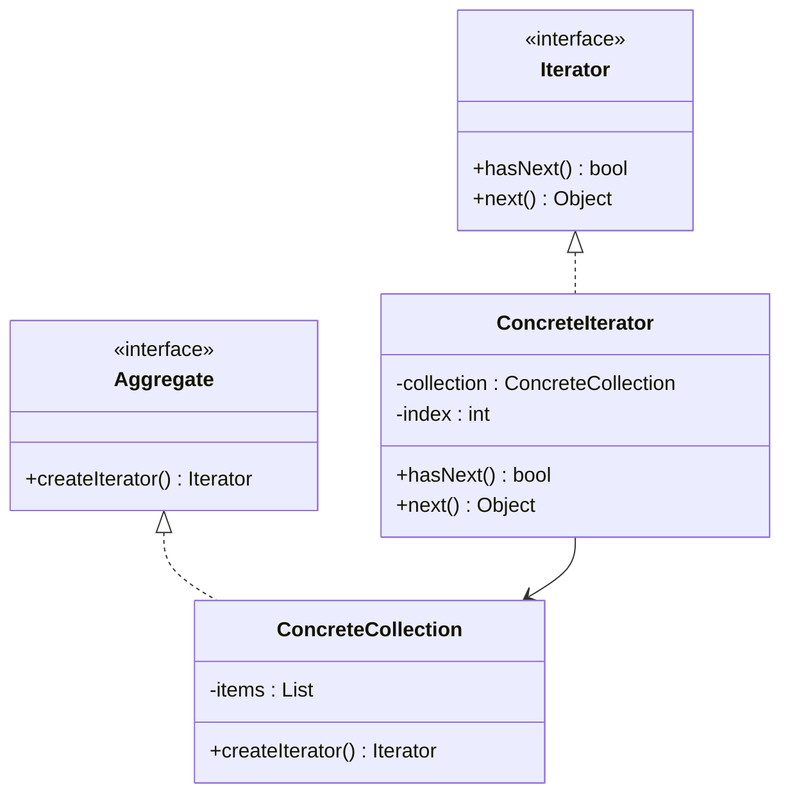

# Iterator Design Pattern

## 📘 Definition
The **Iterator Design Pattern** provides a way to access the elements of a collection (like arrays, lists, trees, etc.) sequentially without exposing its internal representation.

It decouples **collection traversal logic** from the **collection itself**, allowing different traversal methods (forward, reverse, etc.) without modifying the collection.

---

## 🎯 Intent
- To **traverse a collection** without revealing its internal structure.
- To **provide a common interface** for iteration over different types of collections.

---

## 🧩 Real-Life Example
- Browsing songs in a music playlist one by one.
- Navigating through items in a shopping cart.
- Reading lines of text from a file using iterators.

---

## 📊 UML Diagram



---

## 💻 C++ Implementation
```cpp title="iterator-design.cpp" linenums="1"
#include <iostream>
#include <vector>
#include <memory>
using namespace std;

// Iterator Interface
class Iterator {
public:
    virtual bool hasNext() = 0;
    virtual int next() = 0;
    virtual ~Iterator() = default;
};

// Concrete Iterator
class NumberIterator : public Iterator {
    vector<int> numbers;
    size_t index = 0;

public:
    NumberIterator(const vector<int>& nums) : numbers(nums) {}
    bool hasNext() override {
        return index < numbers.size();
    }
    int next() override {
        return hasNext() ? numbers[index++] : -1;
    }
};

// Aggregate (Collection) Interface
class Aggregate {
public:
    virtual unique_ptr<Iterator> createIterator() = 0;
    virtual ~Aggregate() = default;
};

// Concrete Collection
class NumberCollection : public Aggregate {
    vector<int> numbers;

public:
    void addNumber(int n) { numbers.push_back(n); }
    unique_ptr<Iterator> createIterator() override {
        return make_unique<NumberIterator>(numbers);
    }
};

// Client Code
int main() {
    NumberCollection collection;
    collection.addNumber(10);
    collection.addNumber(20);
    collection.addNumber(30);

    auto iterator = collection.createIterator();
    while (iterator->hasNext()) {
        cout << iterator->next() << " ";
    }
    cout << endl;
    return 0;
}
```

---

## 🧠 Output
```cpp linenums="1"
10 20 30
```

---

## ✅ Advantages

- Supports multiple traversals on the same collection.
- Hides complex collection structure.
- Open/Closed Principle: new traversal algorithms can be added easily.

## ⚠️ Disadvantages

- May add extra complexity for simple collections.
- Multiple iterators can cause synchronization issues in concurrent environments.

## 🔗 References

- [Refactoring Guru: Iterator Pattern](https://refactoring.guru/design-patterns/iterator)
- [GeeksforGeeks: Iterator Design Pattern](https://www.geeksforgeeks.org/system-design/iterator-pattern/)
- [Wikipedia: Iterator Pattern](https://en.wikipedia.org/wiki/Iterator_pattern)
