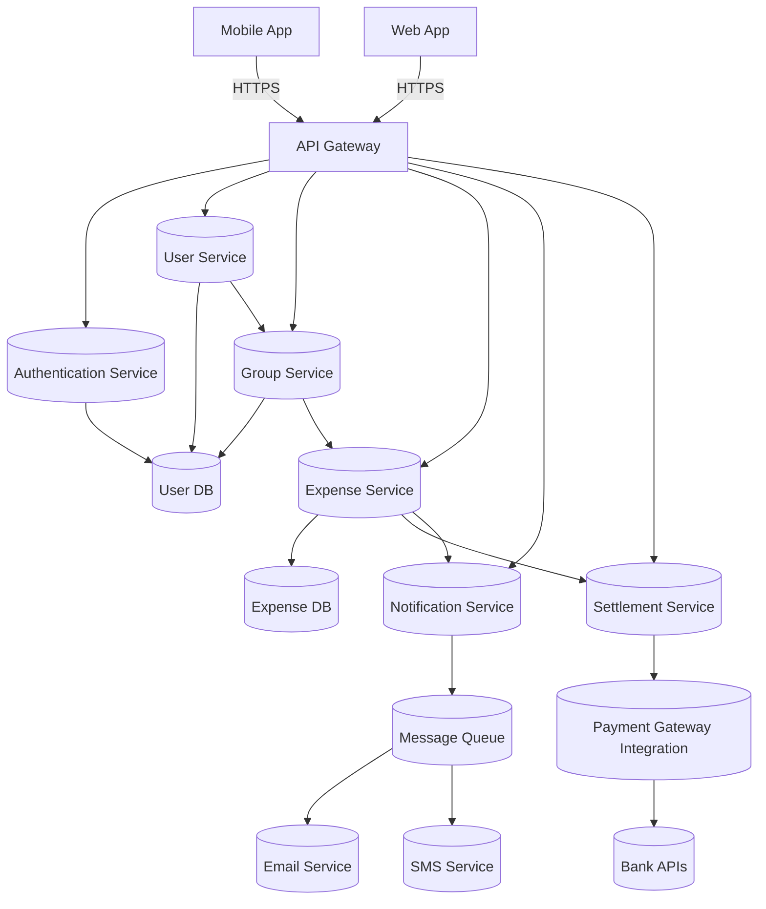

# 🧮 Splitwise Clone — System Design Documentation
## 🧠 Overview

A Splitwise Clone allows users to record shared expenses, split bills among friends or groups, and track balances. The system automatically calculates who owes whom and simplifies settlements.

## 🎯 Objectives

- Allow users to add, track, and settle shared expenses.
- Enable creation of groups (e.g., trips, projects, or roommates).
- Automatically calculate balances and settlements.
- Support scalability, extensibility, and clean modular architecture.

## 🧩 Core Functional Requirements

**1. User Management**

- Register, log in, and manage user profiles.
- View overall balance and group memberships.

**2. Group Management**

- Create and join groups.
- Add or remove members.
- View group-level expenses and balances.

**3. Expense Management**

- Add, edit, and delete expenses.
- Support both equal and custom splits.
- Show detailed expense history.

**4. Balance Calculation**

- Calculate net owed or owing amounts per user.
- Support simplification of debts (reduce total transactions).

**5. Settlement**

- Generate optimal settlements to minimize the number of transactions.
- Integrate optional payment gateways for real transfers.

**6. Notifications**

- Send reminders for pending payments.
- Notify users when new expenses or settlements are added.

---

## ⚙️ Non-Functional Requirements

- **Scalability**: Should handle large groups and multiple concurrent users.

- **Reliability**: Ensure data consistency and fault tolerance.

- **Security**: Use authentication (e.g., JWT) and secure payment APIs.

- **Performance**: Fast retrieval of balances and expenses.

- **Extensibility**: Easy to add features like receipts, categories, or analytics.

---

## 🧱 System Components
**1. Frontend**

- Platforms: Web App and Mobile App

- **Features:**

  - Dashboard for groups and balances.
  - Add/view/edit expenses.
  - Notifications and settlements view.

**2. Backend Services**

- API Gateway – Routes requests to microservices.
- Authentication Service – Handles signup, login, and JWT-based auth.
- User Service – Stores user details and global balances.
- Group Service – Manages group creation and membership.
- Expense Service – Handles expense creation, splits, and balance calculation.
- Settlement Service – Simplifies debts and integrates with payments.
- Notification Service – Sends reminders via email/SMS.

---

## 🗄️ Data Storage
| Entity         | Description             | Example Fields                                             |
| -------------- | ----------------------- | ---------------------------------------------------------- |
| **User**       | Stores user profile     | `id`, `name`, `email`                                      |
| **Group**      | Tracks group info       | `id`, `name`, `members[]`                                  |
| **Expense**    | Represents each expense | `id`, `title`, `amount`, `paid_by`, `splits[]`, `group_id` |
| **Settlement** | Stores settlement info  | `id`, `from_user`, `to_user`, `amount`, `status`           |

---

## 🧮 Balance Calculation Logic

- Each expense adds a credit to the payer and debits to all participants based on their share.

- After processing all expenses:

  - Positive balance → user should receive money.
  - Negative balance → user owes money.

---

## 💱 Settlement Simplification

- To minimize transactions:

  1. Sort users into creditors and debtors.
  2. Match the largest debtor with the largest creditor.
  3. Perform transaction → adjust balances.
  4. Repeat until all balances are settled.

---

## UML Diagrams


---

## C++ Implementation
```cpp title="splitwise-clone.cpp" linenums="1"
/*
  splitwise_clone.cpp
  A compact, single-file C++ skeleton for a Splitwise-like system.
  - In-memory "DB" using unordered_maps
  - Classes: User, Group, Expense, ExpenseService, SettlementService
  - Demonstrates adding users, creating groups, adding expenses,
    computing balances and simplifying debts (greedy algorithm).

  Compile: g++ -std=c++17 splitwise_clone.cpp -O2 -o splitwise
  Run:     ./splitwise
*/

#include <bits/stdc++.h>
using namespace std;
using ID = long long;

static ID NEXT_ID = 1;
inline ID gen_id() { return NEXT_ID++; }

struct User {
    ID id;
    string name;
    string email;
    explicit User(string name_, string email_): id(gen_id()), name(std::move(name_)), email(std::move(email_)) {}
};

struct ExpenseItem {
    ID paid_by;          // user id who paid
    double amount = 0.0; // amount for this item
    vector<pair<ID,double>> splits; // pair<user_id, share>
};

struct Expense {
    ID id;
    ID group_id;
    string title;
    double total = 0.0;
    ID created_by;
    time_t created_at;
    vector<ExpenseItem> items; // for extensibility; typically one item per expense

    Expense(ID group, string title_, double total_, ID creator): id(gen_id()), group_id(group), title(std::move(title_)), total(total_), created_by(creator), created_at(time(nullptr)) {}
};

struct Group {
    ID id;
    string name;
    unordered_set<ID> members; // user ids
    explicit Group(string name_): id(gen_id()), name(std::move(name_)) {}
};

// Simple in-memory "DB"
struct InMemoryDB {
    unordered_map<ID, shared_ptr<User>> users;
    unordered_map<ID, shared_ptr<Group>> groups;
    unordered_map<ID, shared_ptr<Expense>> expenses;

    ID create_user(const string &name, const string &email) {
        auto u = make_shared<User>(name, email);
        users[u->id] = u;
        return u->id;
    }
    ID create_group(const string &name, const vector<ID> &member_ids) {
        auto g = make_shared<Group>(name);
        for (auto m: member_ids) g->members.insert(m);
        groups[g->id] = g;
        return g->id;
    }
    ID create_expense(ID group_id, const string &title, double total, ID creator) {
        auto e = make_shared<Expense>(group_id, title, total, creator);
        expenses[e->id] = e;
        return e->id;
    }
};

// ExpenseService: handles creating expenses and calculating per-user net balances
struct ExpenseService {
    InMemoryDB &db;
    ExpenseService(InMemoryDB &db_): db(db_) {}

    // Adds a simple expense that is split equally among the given participants
    ID add_equal_split_expense(ID group_id, const string &title, double total, ID paid_by, const vector<ID> &participants) {
        if (db.groups.find(group_id) == db.groups.end()) throw runtime_error("group not found");
        if (db.users.find(paid_by) == db.users.end()) throw runtime_error("payer not found");

        ID exp_id = db.create_expense(group_id, title, total, paid_by);
        auto &e = db.expenses[exp_id];
        ExpenseItem item;
        item.paid_by = paid_by;
        item.amount = total;
        double share = total / (double)participants.size();
        for (auto uid: participants) item.splits.push_back({uid, share});
        e->items.push_back(item);
        e->total = total;
        return exp_id;
    }

    // Adds an expense with custom splits (user->share)
    ID add_custom_split_expense(ID group_id, const string &title, double total, ID paid_by, const vector<pair<ID,double>> &splits) {
        if (db.groups.find(group_id) == db.groups.end()) throw runtime_error("group not found");
        if (db.users.find(paid_by) == db.users.end()) throw runtime_error("payer not found");
        double sum = 0.0; for (auto &p: splits) sum += p.second;
        // Allow small FP epsilon
        if (fabs(sum - total) > 1e-6) throw runtime_error("splits do not sum to total");

        ID exp_id = db.create_expense(group_id, title, total, paid_by);
        auto &e = db.expenses[exp_id];
        ExpenseItem item;
        item.paid_by = paid_by;
        item.amount = total;
        item.splits = splits;
        e->items.push_back(item);
        e->total = total;
        return exp_id;
    }

    // Calculate net balances for a specific group: positive means others owe this user, negative means user owes others
    unordered_map<ID, double> compute_group_balances(ID group_id) {
        if (db.groups.find(group_id) == db.groups.end()) throw runtime_error("group not found");
        unordered_map<ID, double> net; // user -> net
        auto &group = db.groups[group_id];

        // initialize net balances
        for (auto uid: group->members) net[uid] = 0.0;

        for (auto &kv: db.expenses) {
            auto &e = kv.second;
            if (e->group_id != group_id) continue;
            for (auto &item: e->items) {
                ID payer = item.paid_by;
                double amount = item.amount;
                // payer paid amount; others owe their share
                net[payer] += amount; // temporarily +total
                for (auto &s: item.splits) {
                    ID uid = s.first;
                    double share = s.second;
                    net[uid] -= share; // they owe share
                }
            }
        }
        // After this: net[u] > 0 means u is creditor (should receive), <0 means debtor
        return net;
    }
};

// Simplify debts: greedily match largest creditor with largest debtor until all settled
struct SettlementService {
    // Returns list of transactions to settle debts: tuple<from (debtor), to (creditor), amount>
    static vector<tuple<ID,ID,double>> simplify_and_settle(const unordered_map<ID,double> &net_map, double eps = 1e-6) {
        // Build two heaps: creditors (positive), debtors (negative)
        priority_queue<pair<double, ID>> creditors; // (amount, id)
        priority_queue<pair<double, ID>> debtors;   // (abs(amount), id)

        for (auto &kv: net_map) {
            ID uid = kv.first;
            double val = kv.second;
            if (val > eps) creditors.push({val, uid});
            else if (val < -eps) debtors.push({-val, uid});
        }

        vector<tuple<ID,ID,double>> settlements;
        while (!creditors.empty() && !debtors.empty()) {
            auto c = creditors.top(); creditors.pop();
            auto d = debtors.top(); debtors.pop();
            double amount = min(c.first, d.first);
            ID creditor_id = c.second;
            ID debtor_id = d.second;
            settlements.emplace_back(debtor_id, creditor_id, amount);

            double c_rem = c.first - amount;
            double d_rem = d.first - amount;
            if (c_rem > eps) creditors.push({c_rem, creditor_id});
            if (d_rem > eps) debtors.push({d_rem, debtor_id});
        }
        return settlements;
    }
};

// Utility: pretty print balances and settlements
void print_balances(const unordered_map<ID,double> &net, const InMemoryDB &db) {
    cout << "-- Net Balances --\n";
    for (auto &kv: net) {
        ID uid = kv.first; double v = kv.second;
        string name = (db.users.count(uid) ? db.users.at(uid)->name : to_string(uid));
        cout << name << " (" << uid << ") : " << fixed << setprecision(2) << v << "\n";
    }
}

void print_settlements(const vector<tuple<ID,ID,double>> &settlements, const InMemoryDB &db) {
    cout << "-- Settlements Suggested --\n";
    for (auto &t: settlements) {
        ID from, to; double amt; tie(from,to,amt) = t;
        string fromName = (db.users.count(from) ? db.users.at(from)->name : to_string(from));
        string toName   = (db.users.count(to)   ? db.users.at(to)->name   : to_string(to));
        cout << fromName << " -> " << toName << " : " << fixed << setprecision(2) << amt << "\n";
    }
}

// Demo usage in main
int main() {
    ios::sync_with_stdio(false);
    cin.tie(nullptr);

    InMemoryDB db;
    ExpenseService expenseService(db);

    // Create users
    ID alice = db.create_user("Alice", "alice@example.com");
    ID bob   = db.create_user("Bob",   "bob@example.com");
    ID carol = db.create_user("Carol", "carol@example.com");
    ID dave  = db.create_user("Dave",  "dave@example.com");

    // Create a group with Alice, Bob, Carol, Dave
    vector<ID> members = {alice, bob, carol, dave};
    ID trip = db.create_group("Weekend Trip", members);

    // Alice pays 120 split equally among 4
    expenseService.add_equal_split_expense(trip, "Groceries", 120.0, alice, members);

    // Bob pays 60 split between Alice and Bob only
    expenseService.add_custom_split_expense(trip, "Taxi", 60.0, bob, {{alice,30.0},{bob,30.0}});

    // Carol pays 80 split among Bob, Carol, Dave (3 people)
    expenseService.add_custom_split_expense(trip, "Dinner", 80.0, carol, {{bob, 26.6666667},{carol,26.6666667},{dave,26.6666666}});

    // Compute balances
    auto net = expenseService.compute_group_balances(trip);
    print_balances(net, db);

    // Simplify debts and print suggested settlements
    auto settlements = SettlementService::simplify_and_settle(net);
    print_settlements(settlements, db);

    return 0;
}
```

---

## 🌐 External Integrations

- Payment Gateway: Razorpay / Stripe API for real settlements.
- Email/SMS Service: Twilio, SendGrid for reminders.
- Message Queue (Kafka/RabbitMQ): For async notification delivery.

## 🧭 Summary

This system provides a modular, scalable foundation for a Splitwise-like expense-sharing app.
It separates responsibilities across distinct services, supports debt simplification, and allows future integrations without major refactoring.
