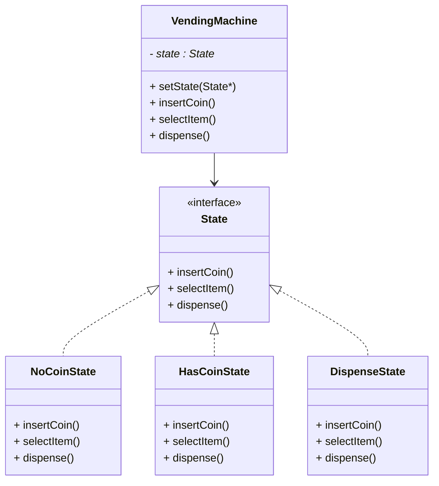

# 🏪 State Design Pattern — Vending Machine Example

## 📘 Definition
The **State Design Pattern** allows an object to alter its behavior when its **internal state changes**.  
The object will appear to **change its class** at runtime.

---

## 🎯 Intent
To **encapsulate state-specific behavior** and **delegate behavior to the current state object** instead of using large conditional statements.

---

## 🧩 Real-Life Analogy
A **Vending Machine** behaves differently depending on its state:
- If no coin is inserted, it waits for money.
- If money is inserted, it allows selection.
- After dispensing, it returns to idle state.

Each of these actions corresponds to a **different state** with unique behavior.

---

## ⚙️ Key Participants
| Component | Role |
|------------|------|
| **Context** | Maintains current state and delegates requests to it (`VendingMachine`) |
| **State (Interface)** | Defines the interface for encapsulating state-specific behavior |
| **Concrete States** | Implement behaviors for a specific state (`NoCoinState`, `HasCoinState`, `DispenseState`) |

---

## 📊 UML Diagram



---

## 💻 C++ Implementation
```cpp
#include <iostream>
#include <memory>
using namespace std;

// Forward declaration
class State;
class VendingMachine;

// --- State Interface ---
class State {
public:
    virtual void insertCoin(VendingMachine* vm) = 0;
    virtual void selectItem(VendingMachine* vm) = 0;
    virtual void dispense(VendingMachine* vm) = 0;
    virtual ~State() = default;
};

// --- Context Class ---
class VendingMachine {
    shared_ptr<State> state;
public:
    void setState(shared_ptr<State> newState) { state = newState; }
    void insertCoin() { state->insertCoin(this); }
    void selectItem() { state->selectItem(this); }
    void dispense() { state->dispense(this); }

    // Getters for reusable static states
    static shared_ptr<State> noCoinState;
    static shared_ptr<State> hasCoinState;
    static shared_ptr<State> dispenseState;
};

// --- Concrete States ---
class NoCoinState : public State {
public:
    void insertCoin(VendingMachine* vm) override {
        cout << "Coin inserted.\n";
        vm->setState(VendingMachine::hasCoinState);
    }
    void selectItem(VendingMachine* vm) override {
        cout << "Insert coin first.\n";
    }
    void dispense(VendingMachine* vm) override {
        cout << "Cannot dispense. No coin.\n";
    }
};

class HasCoinState : public State {
public:
    void insertCoin(VendingMachine* vm) override {
        cout << "Coin already inserted.\n";
    }
    void selectItem(VendingMachine* vm) override {
        cout << "Item selected.\n";
        vm->setState(VendingMachine::dispenseState);
    }
    void dispense(VendingMachine* vm) override {
        cout << "Select item first.\n";
    }
};

class DispenseState : public State {
public:
    void insertCoin(VendingMachine* vm) override {
        cout << "Please wait, dispensing item.\n";
    }
    void selectItem(VendingMachine* vm) override {
        cout << "Already dispensing.\n";
    }
    void dispense(VendingMachine* vm) override {
        cout << "Item dispensed!\n";
        vm->setState(VendingMachine::noCoinState);
    }
};

// --- Define static states ---
shared_ptr<State> VendingMachine::noCoinState = make_shared<NoCoinState>();
shared_ptr<State> VendingMachine::hasCoinState = make_shared<HasCoinState>();
shared_ptr<State> VendingMachine::dispenseState = make_shared<DispenseState>();

// --- Client Code ---
int main() {
    VendingMachine machine;
    machine.setState(VendingMachine::noCoinState);

    machine.selectItem();   // No coin
    machine.insertCoin();   // Insert coin
    machine.selectItem();   // Select item
    machine.dispense();     // Dispense item

    return 0;
}
```

---

## 🧠 Output
```
Insert coin first.
Coin inserted.
Item selected.
Item dispensed!
```

---

## ✅ Advantages

- Eliminates large if-else or switch-case blocks.
- Easier to add new states without modifying existing code.
- Improves readability and maintainability.

---

## ⚠️ Disadvantages

- Increases the number of classes.
- Requires careful state transition management.

 ---

## 🧱 System Design View

- Each state is a plug-and-play module that can be added or modified independently.
- Makes the vending machine scalable and easy to extend for new states like OutOfStockState or MaintenanceState.

## 🔗 References

- [Refactoring Guru: State Pattern](https://refactoring.guru/design-patterns/state)
- [GeeksforGeeks: State Design Pattern](https://www.geeksforgeeks.org/system-design/state-design-pattern/)
- [Wikipedia: State Pattern](https://en.wikipedia.org/wiki/State_pattern)
