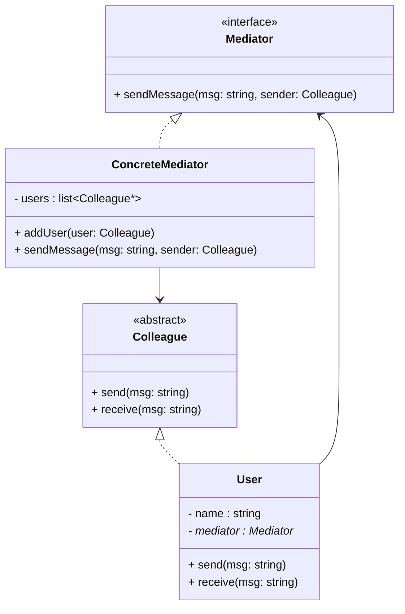

# 💬 Mediator Design Pattern — Chat Room Example

## 📘 Definition
The **Mediator Design Pattern** is a **behavioral pattern** that defines an object (the *mediator*) to **encapsulate how a set of objects interact**.  
It promotes **loose coupling** by preventing objects from referring to each other directly — instead, they communicate through the mediator.

---

## 🎯 Intent
To **centralize communication** between multiple objects so that they don’t need to explicitly reference each other.

---

## 🧩 Real-Life Analogy
Consider a **chat room** where multiple users can send messages.  
Instead of each user directly sending messages to all others, they send it to a **ChatRoom (Mediator)**, which then handles message delivery.  
This makes communication structured and controlled.

---

## ⚙️ Key Participants
| Participant | Role |
|--------------|------|
| **Mediator (Interface)** | Defines communication methods between objects. |
| **ConcreteMediator** | Implements communication logic between objects. |
| **Colleague (Component)** | Represents individual objects that communicate via mediator. |
| **ConcreteColleague** | Concrete implementation of a colleague class. |

---

## 📊 UML Diagram



---

## 💻 C++ Implementation
```cpp title="mediator-design.cpp" linenums="1"
#include <iostream>
#include <vector>
#include <string>
#include <memory>
using namespace std;

// Forward declaration
class User;

// Mediator Interface
class ChatMediator {
public:
    virtual void sendMessage(const string& msg, User* sender) = 0;
    virtual void addUser(shared_ptr<User> user) = 0;
    virtual ~ChatMediator() = default;
};

// Colleague (User) Interface
class User {
protected:
    string name;
    ChatMediator* mediator;
public:
    User(string n, ChatMediator* m) : name(move(n)), mediator(m) {}
    virtual void send(const string& msg) = 0;
    virtual void receive(const string& msg) = 0;
    string getName() const { return name; }
    virtual ~User() = default;
};

// Concrete Mediator
class ConcreteChatMediator : public ChatMediator {
    vector<shared_ptr<User>> users;
public:
    void addUser(shared_ptr<User> user) override {
        users.push_back(user);
    }

    void sendMessage(const string& msg, User* sender) override {
        for (auto& user : users) {
            if (user->getName() != sender->getName())
                user->receive(sender->getName() + ": " + msg);
        }
    }
};

// Concrete User (Colleague)
class ChatUser : public User {
public:
    ChatUser(string n, ChatMediator* m) : User(move(n), m) {}
    void send(const string& msg) override {
        cout << name << " sends: " << msg << endl;
        mediator->sendMessage(msg, this);
    }

    void receive(const string& msg) override {
        cout << name << " receives -> " << msg << endl;
    }
};

// Client Code
int main() {
    ConcreteChatMediator chatRoom;

    auto user1 = make_shared<ChatUser>("Alice", &chatRoom);
    auto user2 = make_shared<ChatUser>("Bob", &chatRoom);
    auto user3 = make_shared<ChatUser>("Charlie", &chatRoom);

    chatRoom.addUser(user1);
    chatRoom.addUser(user2);
    chatRoom.addUser(user3);

    user1->send("Hello, everyone!");
    user2->send("Hi Alice!");
    return 0;
}
```

---

## 🧠 Output
```yaml
Alice sends: Hello, everyone!
Bob receives -> Alice: Hello, everyone!
Charlie receives -> Alice: Hello, everyone!
Bob sends: Hi Alice!
Alice receives -> Bob: Hi Alice!
Charlie receives -> Bob: Hi Alice!
```

---

## ✅ Advantages

- Loose coupling — objects don’t need to know about each other directly.
- Centralized control — all communication is managed in one place.
- Easy to add new participants without modifying existing classes.

## ⚠️ Disadvantages

- The mediator can become complex as the number of interactions grows.
- Centralized logic may lead to a God Object if not designed carefully.

## 💡 Use Cases

- Chat applications or messaging systems.
- Air traffic control systems (planes communicate via control tower).
- UI event coordination (buttons, forms, modals).

## 🧱 System Design View

In large systems:

   - The Mediator can be implemented as a Message Bus or Event Dispatcher.
   - Helps integrate microservices or components without tight dependencies.

## 🔗 References

- [Refactoring Guru: Mediator Pattern](https://refactoring.guru/design-patterns/mediator)
- [GeeksforGeeks: Mediator Design Pattern](https://www.geeksforgeeks.org/system-design/mediator-design-pattern/)
- [Wikipedia: Mediator Pattern](https://en.wikipedia.org/wiki/Mediator_pattern)
