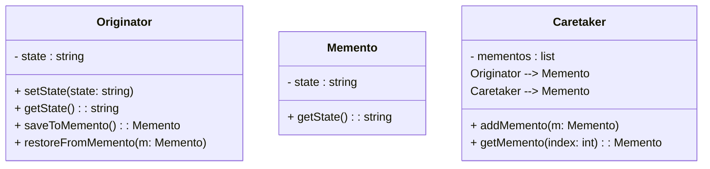

# 🧠 Memento Design Pattern

## 📘 Intent
The **Memento Design Pattern** is a **behavioral pattern** that allows an object to **save and restore its state** without exposing its internal representation.  
It is useful when you want to provide an **undo mechanism** or **rollback** functionality.

---

## 🧩 Structure
- **Originator** → The object whose state needs to be saved.
- **Memento** → Stores the internal state of the Originator.
- **Caretaker** → Responsible for keeping track of the Memento objects but never modifies them.

---

## 🧱 UML Diagram



---

## 💻 C++ Implementation
```cpp title="memento-design.cpp" linenums="1"
#include <iostream>
#include <vector>
#include <string>
using namespace std;

// Memento class
class Memento {
    string state;
public:
    Memento(const string &s) : state(s) {}
    string getState() const { return state; }
};

// Originator class
class Originator {
    string state;
public:
    void setState(const string &s) { state = s; }
    string getState() const { return state; }

    Memento saveToMemento() { return Memento(state); }
    void restoreFromMemento(const Memento &m) { state = m.getState(); }
};

// Caretaker class
class Caretaker {
    vector<Memento> history;
public:
    void addMemento(const Memento &m) { history.push_back(m); }
    Memento getMemento(int index) { return history[index]; }
};

// Main demonstration
int main() {
    Originator originator;
    Caretaker caretaker;

    originator.setState("State #1");
    caretaker.addMemento(originator.saveToMemento());

    originator.setState("State #2");
    caretaker.addMemento(originator.saveToMemento());

    originator.setState("State #3");
    cout << "Current State: " << originator.getState() << endl;

    // Undo operation
    originator.restoreFromMemento(caretaker.getMemento(0));
    cout << "Restored to: " << originator.getState() << endl;

    return 0;
}
```

---

## 🧠 Key Points

- Mementos should be immutable after creation.
- The Caretaker should not modify the stored Memento objects.
- Commonly used in text editors, games, and version control systems.

---

## 🔗 Reference

- [Refactoring.Guru — Memento Pattern](https://refactoring.guru/design-patterns/memento)
- [SourceMaking — Memento Design Pattern](https://sourcemaking.com/design_patterns/memento)
