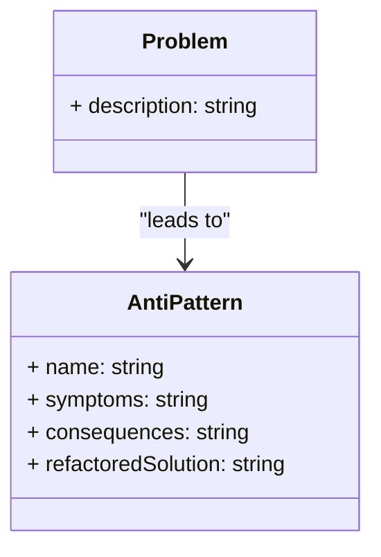

# 🚫 Anti-Patterns

## 📘 Definition
An **Anti-Pattern** is a **common but ineffective or counterproductive solution** to a recurring problem.  
While **design patterns** represent *best practices*, **anti-patterns** represent *bad practices* that initially seem useful but eventually cause more harm than good.

---

## 🧩 Characteristics
- Appears to be a good idea initially.  
- Causes negative long-term consequences.  
- Has a **better alternative** that should be used instead.

---

## 🧱 UML Overview (General Pattern)

---

## 🧠 Common Software Anti-Patterns
| **Anti-Pattern**           | **Description**                                                                | **Better Alternative**                                          |
| -------------------------- | ------------------------------------------------------------------------------ | --------------------------------------------------------------- |
| **Spaghetti Code**         | Code without structure or modularity; tangled dependencies.                    | Use proper architecture, design patterns, and modularization.   |
| **God Object**             | A single class does everything, violating the Single Responsibility Principle. | Split responsibilities into multiple cohesive classes.          |
| **Golden Hammer**          | Using one familiar technology or pattern for all problems.                     | Choose tools and patterns based on context.                     |
| **Copy-Paste Programming** | Reusing code by copying instead of abstraction.                                | Refactor common code into reusable modules/functions.           |
| **Magic Numbers/Strings**  | Using unexplained constants in code.                                           | Use named constants or enums for readability.                   |
| **Premature Optimization** | Optimizing before identifying real bottlenecks.                                | Focus on clarity first; optimize with profiling data.           |
| **Cargo Cult Programming** | Applying patterns or practices without understanding their purpose.            | Understand the intent behind each technique before applying it. |

---

## 💡 How to Avoid Anti-Patterns

- Follow SOLID principles (especially SRP and OCP).
- Perform code reviews to detect design flaws early.
- Refactor continuously instead of rewriting large parts later.
- Use design patterns judiciously, only where they fit.
- Write tests to prevent regressions during improvement.

---

## 🧰 When Anti-Patterns Can Be Useful

Sometimes, anti-patterns may be acceptable as temporary solutions — for example, quick prototypes or proof-of-concept code — only if they are refactored later.

## 🔗 References

- [Refactoring.Guru — Anti-Patterns](https://refactoring.guru/refactoring/smells)
- [SourceMaking — Anti-Patterns Catalog](https://sourcemaking.com/design_patterns)
- [Wikipedia — Anti-Pattern](https://en.wikipedia.org/wiki/Anti-pattern)
