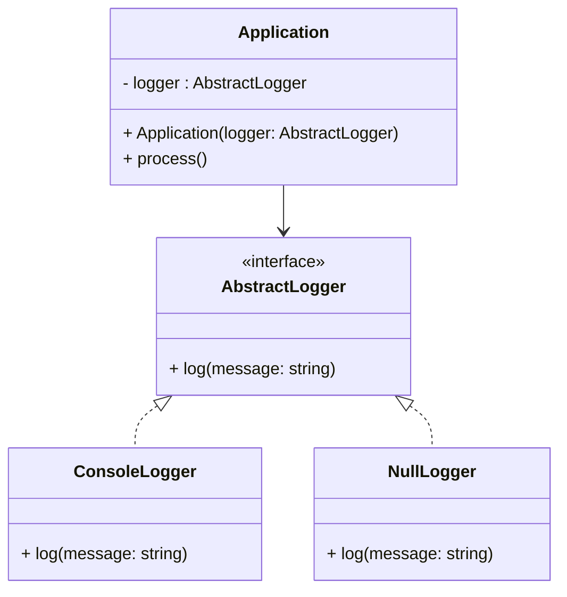

# 🧱 Null Object Design Pattern

## 📘 Overview

The **Null Object Pattern** is a **behavioral design pattern** that provides a **default “do-nothing” object** in place of `null` references.  
Instead of checking for `null` before every use, the pattern defines an object that implements the expected interface but performs **no operation**.

This avoids **null reference errors** and simplifies client code.

---

## 💡 Intent

- Encapsulate the absence of an object by providing a neutral “null” behavior.  
- Eliminate `if (obj != null)` checks throughout the code.  
- Promote cleaner, safer, and more polymorphic designs.

---

## 🧩 Participants

| **Role** | **Description** |
|-----------|----------------|
| **Abstract Class / Interface** | Defines operations expected by clients. |
| **Real Object** | Provides real functionality. |
| **Null Object** | Implements the same interface but performs no operation. |
| **Client** | Works with both real and null objects uniformly. |

---

## 🧭 UML Diagram



---

## 💻 C++ Implementation
```cpp
#include <iostream>
#include <memory>
#include <string>
using namespace std;

// Abstract Logger Interface
class Logger {
public:
    virtual void log(const string& message) = 0;
    virtual ~Logger() = default;
};

// Real Object
class ConsoleLogger : public Logger {
public:
    void log(const string& message) override {
        cout << "[LOG]: " << message << endl;
    }
};

// Null Object
class NullLogger : public Logger {
public:
    void log(const string& message) override {
        // Do nothing
    }
};

// Client
class Application {
private:
    unique_ptr<Logger> logger;
public:
    Application(unique_ptr<Logger> loggerObj) : logger(move(loggerObj)) {}

    void process() {
        logger->log("Application started");
        // Some operations
        logger->log("Processing data...");
        // No need to check for null logger
    }
};

// Usage
int main() {
    cout << "--- Using ConsoleLogger ---" << endl;
    Application app1(make_unique<ConsoleLogger>());
    app1.process();

    cout << "\n--- Using NullLogger ---" << endl;
    Application app2(make_unique<NullLogger>());
    app2.process();

    return 0;
}
```

---

## ✅ Advantages

- Removes repetitive null checks.
- Makes code cleaner and safer.
- Simplifies logic in client classes.
- Increases polymorphism and extensibility.

---

## ⚠️ When to Use

- When you have optional components (e.g., logging, monitoring, caching).
- When a "no-operation" behavior is acceptable instead of explicit null handling.
- In systems where null values can cause frequent runtime crashes.

---

## 💡 Real-World Example

- Logging systems where some modules may not need logs.
- Payment gateways where a “No Payment” method acts as a placeholder.
- Notification services where silent operations may be required.

---

## 🔗 References

- [Refactoring.Guru – Null Object Pattern](https://refactoring.guru/design-patterns/null-object)
- [SourceMaking – Null Object Pattern](https://sourcemaking.com/design_patterns/null_object)
- [GeeksforGeeks – Null Object Design Pattern](https://www.geeksforgeeks.org/null-object-pattern/)
